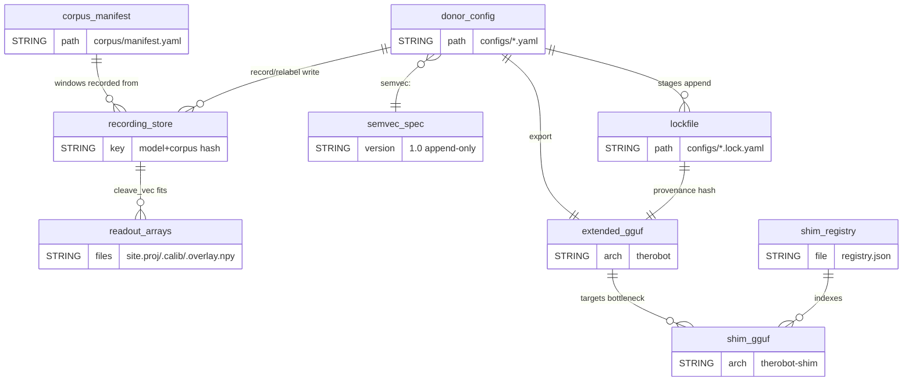
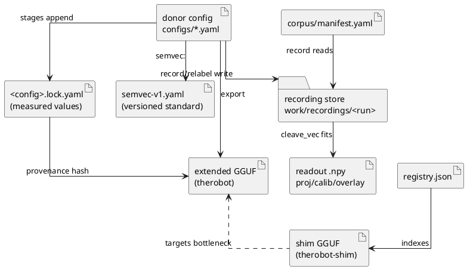

# Project Schema — therobotgguf

> **No persistence layer.** This project has **no database, no SQL schema, and no
> Liquibase changelogs**. All state is file-based: YAML configs, a measured-values
> lockfile, NumPy arrays on disk, and the GGUF model files the pipeline emits.
> This document is the reference for those **file formats and data artifacts** —
> treat it the way other projects treat their DB schema. Versioning follows the
> repo's contract rule (`arch/runtime/gguf-extension-spec.md`): contracts are
> never patched in place; breaking changes bump the spec version.

## Artifact map

Everything flows from the per-donor config. Stages append *measured* values to
the lockfile; downstream stages and the exporter consume only measured values.





## 1. Per-donor config — `convert/configs/<donor>.yaml`

The single declarative artifact per donor. Structure defined by
`convert/robotgguf/config.py`. Full field reference with commentary:
`configs/qwen3.5-0.8b.yaml` (primary, heavily commented).

| Group | Fields | Stage |
|-------|--------|-------|
| identity | `donor` (HF id or local path), `base_architecture` (stock GGUF arch string), `base_gguf` (optional pre-converted stock file) | R0 |
| corpus | `corpus` — bare text-file list (v0, equal-share strata) or `corpus/manifest.yaml` path (v1 stratified) | R1 |
| semvec | `semvec` — path to the versioned spec (§2); admission knobs `min_axis_decodability`, `min_axis_selectivity`, `min_domain_stability_ratio`, `mlp_fallback_max`, `vec_l2`, `vec_sample_cap` | R2 v1 |
| cleave | `attributes` (v0 categorical list), `candidate_sites` (`{name, layer, point, offset, width}`), `max_bottlenecks`, `min_decodability`, `min_selectivity` (balanced-accuracy thresholds) | R2 |
| graft | `state_banks` (`{name: fast/mid/slow/glacial, width}`), `state_layers`, `film_layers`, `modulator` (`{dim, channels[], source: pooled/glacial}`) | R3 |
| delta | `delta.enabled`, `target_keep_rate`, `heartbeat`, `layers` | R4 |
| shims | `shims[]` — `{name, attribute, direction, scale, tags}` (v0); `semvec_shims` for compiled shims | R5 |
| memory | `memory` — `key_dim`, `capacity`, `decay_halflife`, `salience_threshold_quantile`, nested `salience` weights (`surprise`, `mnorm`, `floor`, optional per-channel) | runtime |
| settle | `settle.enabled` (v0: false — diffusion-class donors only) | R6 |
| export | `features` (subset of `taps/shims/state/modulator/memory/delta/settle`), `level` (0–5) | R7 |
| paths | `gguf_py`, `runtime_bin` (llama.cpp fork), `recordings`, `workdir` | all |

## 2. Semvec spec — `convert/configs/semvec-v1.yaml`

**A versioned standard, not a per-donor artifact** — append-only axes, major
version bump for basis/embedder changes. Defined in `extraction-v1.md` §3.

| Section | Content |
|---------|---------|
| `semvec` | `version` ("1.0"), `named_dim` (128), `latent_dim` (384), `scale` [0,4] ordinal |
| `latent` | Pinned embedder identity + frozen basis (`embedder`, `embedder_revision`, `basis` npz path, `basis_sha256`; `null` until frozen) |
| `groups` | 9 named-axis groups with `start` offsets: affect, register, discourse, epistemics, safety, topic, structure, entities, language |
| `tiers` | Best label source per group: `t0` heuristic / `t1` classifier / `t2` teacher-LLM |
| `views` | Categorical views reconstructing the v0 seven attributes — `kind: threshold` (bins over one axis) or `argmax` (winner among axes + `floor`/`fallback`) |

## 3. Conversion lockfile — `convert/configs/<config>.lock.yaml`

State file: stages **append measured outputs**; the exporter consumes only
measured values, never hand-entered ones. **Do not edit by hand.**

Top-level keys appear as stages run (observed: `record`, `cleave`; same pattern
per stage): `record` = `{n_samples, corpus_hash, sites[], labeler}`; `cleave` =
`{recordings: {model, corpus}, bottlenecks[]}` where each bottleneck carries
`layer/point/offset/width/name`, admitted `attributes`, and per-attribute
`scores.{decodability, selectivity, stability}`.

## 4. Corpus manifest — `corpus/manifest.yaml` (generated, gitignored)

Written by `tools/fetch_corpus.py`, consumed by `robotgguf/corpus.py`:

```yaml
strata:
  - { domain: web-en, file: corpus/web-en.txt, share: 0.25 }   # shares sum to 1
provenance:
  - { domain: web-en, dataset: HuggingFaceFW/fineweb, license: odc-by }
```

Back-compat: a bare `corpus:` file list in the donor config becomes one
equal-share stratum per file.

## 5. Recording store — `work/recordings/<run>/` (generated, gitignored)

The versioned contract between R1 and every training stage. Layout from
`robotgguf/recordings.py`:

| File | Format | Content |
|------|--------|---------|
| `manifest.json` | JSON | `{model, corpus, spec_version, n_samples, sites{name→layer/point/offset/width}, attributes, shards[], domain_names[], semvec{version,hash}}` |
| `<site>/act.npy` | fp16 `[n_samples, width]` | Bottleneck activations per candidate site (memmap-loaded) |
| `labels/<attribute>.npy` | int64 `[n_samples]` | Categorical weak labels (regenerable via `relabel`) |
| `labels/vector.npy` | fp16 `[n_samples, D]` | Semvec label vector (t0+) |
| `labels/domain.npy` | int64 `[n_samples]` | Stratum/domain id per sample (indexes `domain_names`) |
| `labels/vector_sources.json` | JSON | Which tier wrote each axis (`semvec_version`, `semvec_hash`, per-axis source) |

Related readout artifacts (C4, `cleave_vec` + `overlay.py`): per site
`{site}.proj` / `.calib` / `.overlay.npy` (ridge readout, calibration, write-
calibrated overlay), plus the frozen semvec basis `work/semvec-v1-basis.npz`.

## 6. Model files — extended GGUF

The primary "database" of the project: single-file extended GGUFs, arch
`therobot` (and `therobot-shim` for hot-loadable shim modules). Full key/tensor
reference extracted to **[schema/gguf-format.md](schema/gguf-format.md)** —
identity/negotiation keys, per-feature (`taps`, `state`, `modulator`,
`memory`, `delta`, `settle`) keys and tensors, quantization exemptions, the
`strip` interop downgrade, and shim module files + `registry.json`.

## 7. Environment / secrets

No secrets live in this repo. Runtime environment contract is the runpod
Dockerfile (`runpod/`): `THEROBOT_ROOT`, `THEROBOT_DATA`, `HF_HOME`,
`TRANSFORMERS_CACHE`, `ROBOTGGUF_MODELS`, `ROBOTGGUF_CORPUS`,
`LLAMA_CPP_ROOT`, `LLAMA_CPP_BIN` — see `docs/layout/runpod.md`. HF auth on GPU
hosts is whatever the ambient environment provides (no token files here).
