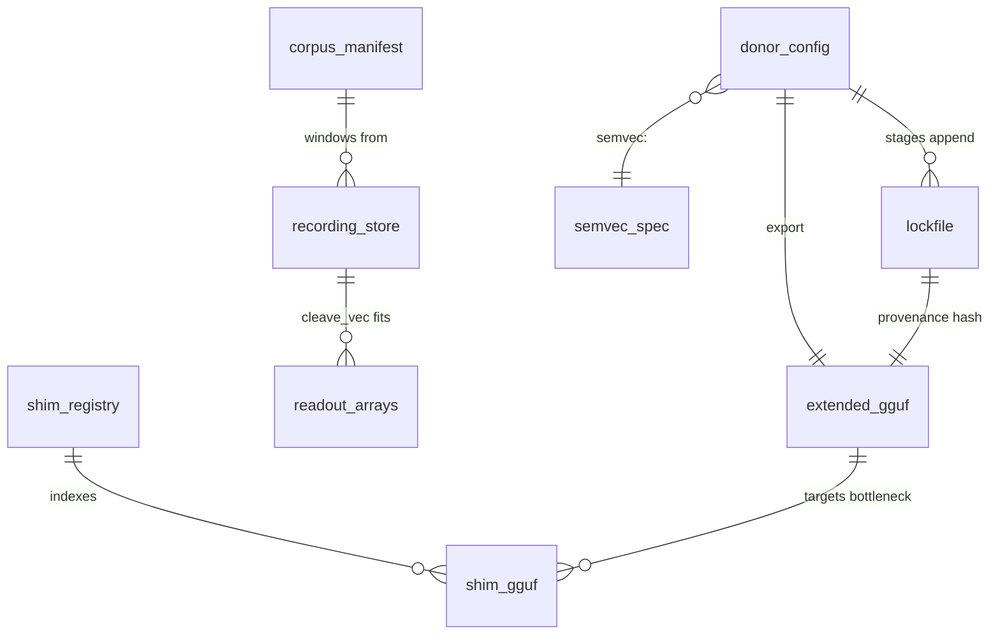

# PROJ-SCHEMA Summary — therobotgguf

**No persistence layer** — no DB, no SQL schema. All state is file-based.
One-line artifact registry (details: `PROJ-SCHEMA.md`):

| Artifact | Path | Format | Written by |
|----------|------|--------|-----------|
| Donor config | `convert/configs/<donor>.yaml` | YAML | human (declarative, per donor) |
| Conversion lockfile | `convert/configs/<config>.lock.yaml` | YAML | stages append measured values — do not hand-edit |
| Semvec spec | `convert/configs/semvec-v1.yaml` | YAML | versioned standard, append-only |
| Corpus manifest | `corpus/manifest.yaml` (gitignored) | YAML | `tools/fetch_corpus.py` |
| Recording store | `work/recordings/<run>/` (gitignored) | manifest.json + act/label `.npy` | R1 record / relabel |
| Readout arrays | `work/<...>/{site}.proj/.calib/.overlay.npy` (gitignored) | NumPy | cleave_vec / overlay |
| Semvec basis | `work/semvec-v1-basis.npz` (gitignored) | NumPy | `labelvec --fit-basis` (frozen + sha256) |
| Extended model | `work/*.gguf` | GGUF, arch `therobot` | R7 export |
| Shim module | standalone `.gguf` | GGUF, arch `therobot-shim` | export / registry tooling |
| Shim registry | `registry.json` | JSON | converter tooling |

## Simplified artifact ERD

## Versioning rule

GGUF contracts (`therobot`, `therobot-shim`) are versioned via
`therobot.spec_version`; never patched in place. Semvec spec is append-only
(major bump for basis/embedder change). Recording stores are versioned
contracts (`spec_version` in `manifest.json`).
