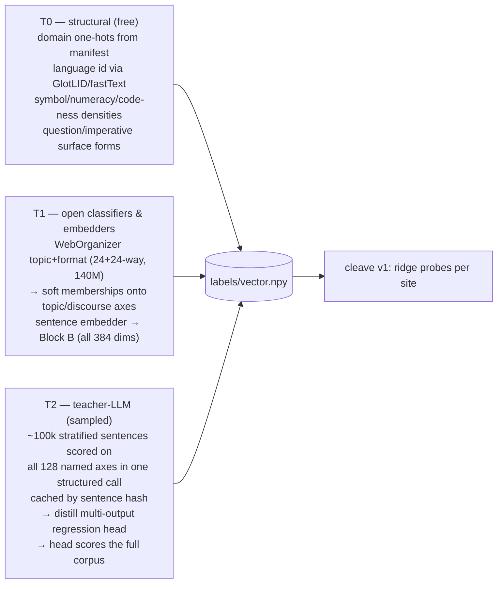

# extraction-v1 — Corpus scale-up + vectorized attribute extraction

**Purpose in one sentence:** build the **standardized readout layer** — a
versioned, donor-independent semantic vector (semvec) into which any donor's
internal state is projected, so that the state of the input's features (is
the subject a dog or a cat, is the tone formal, is menace rising) can be
extracted *on demand*, observed live, and consumed by reusable modules that
work across donors.
**Status:** conversion-side core **implemented** (2026-07-08): C1 (manifest +
stratified loader), C2 (semvec spec + t0 labelers + t1/t2 layering via
`robotgguf labelvec`), C4 core (vector cleave + readout/overlay pair) — all
covered by `convert/tests/extraction_test.py`, no GPU needed. Donor configs
verified for Qwen3.5-0.8B, Qwen3.5-9B, Qwen3.6-35B-A3B, all against
semvec/v1. Compute split: teacher inference on Modal
(`tools/modal_teacher.py`); recording/label/training passes on a rented GPU
host via the plain CLI. Remaining: §9 next steps.
**Scope:** the R1/R2 side of the conversion pipeline only — recording corpus,
labelers, probes, admission. No runtime (E-tier) changes; the GGUF contract
(`robot.probe.*` tensors, the recording-store label files) is extended
backward-compatibly, not broken.
**Last updated:** 2026-07-08.

---

## 1. Why (recap) and what v0 actually measured

Cleave can only admit an attribute where the corpus makes it *vary*
(overview §4.3). v0's substrate was ~300 MB of FineWeb + FineWeb-2 slices plus
~425 KB of synthetic suites, labeled by seven heuristic lexicon labelers —
enough to validate the apparatus (it correctly dropped `language` on the
monolingual sandbox run and produced the first depth-map findings), not enough
to map the model.

Four v0 limitations this plan removes, plus one latent bug it fixes:

1. **Corpus coverage.** No code, no mathematics, no scientific prose, no
   literature. Attributes that only vary across domains (code-vs-prose,
   proof register, symbolic density) are untestable, and every admitted
   bottleneck is implicitly "on web text" with no cross-domain check.
2. **Label bandwidth.** Seven scalar attributes is a hand-picked checklist,
   not a description. A 128-wide slice of the residual stream carries far
   more structure than seven coarse class ids can resolve; probing it against
   seven labels is measuring a 128-dim signal with a 7-question survey. The
   label side must itself be a **vector** (§4) — wide enough that the map can
   find concepts nobody thought to name.
3. **Label quality.** Lexicon heuristics are fine for bootstrap decodability;
   too noisy to trust selectivity margins near the admission bar, and
   structurally unable to score judgment axes (certainty, factuality,
   menace-without-threat-words).
4. **Probe reach.** Linear classifier probes on six fixed 128-wide slices at
   `resid_post`, offset 0. A concept that is nonlinearly coded, lives at
   offset 512, or concentrates in `attn_out` is invisible.
5. **The loader bug (found writing this plan).** `record._load_corpus`
   reads `cfg.corpus` files *sequentially* and stops at `max_tokens`. With
   `corpus: [mixed-text.txt, behavioral-suites.txt]` and the default 200k-token
   budget, recordings come from roughly the first megabyte of
   `mixed-text.txt` (the loader's own docstring does the math: a 2M-token
   budget reads ~8 MB of a 300 MB corpus) — i.e. essentially the head of the
   English FineWeb stream, since `fetch_corpus.py` writes its sources in
   order, English first. The behavioral suites and the FineWeb-2 language
   slices likely never entered the v0 recordings at all. Stratified sampling
   at load time (§3.3) is therefore not just a v1 feature — it is a
   correctness fix, and it may explain some of v0's admission table. Re-run
   v0 cleave after C1 to re-baseline before trusting any v0-vs-v1 comparison.

The admission discipline itself — decodability, selectivity against a control,
stability — does not change. The instrument gets sharper, the label side gets
a dimension count worthy of the signal, and the map gets larger.

---

## 2. Corpus v1

### 2.1 Composition

Seven domain strata, all streamable from HF, all permissively licensed
(ODC-BY / Apache-2.0; attribution noted in the manifest). Sizes are what we
*keep on disk*, not what we record — the recording budget is a separate,
smaller number (§6).

| Stratum | Source | Share | ~Disk | Why |
|---|---|---|---|---|
| web-en | `HuggingFaceFW/fineweb` (sample-10BT) | 25% | 5 GB | naturalistic baseline; register/sentiment/entity spread |
| multilingual | `HuggingFaceFW/fineweb-2` — widen to ~10 langs across scripts (fra, deu, spa, rus, ukr, jpn, zho, kor, ara, hin) | 20% | 4 GB | language axes upgraded from script-class to language-id (§5.1); cross-script stability |
| code | `HuggingFaceTB/stack-edu` (ungated, 125B-token educational filter of Stack-v2/StarCoder2Data; per-language configs) | 20% | 4 GB | code axes, symbolic density; the largest distribution shift we can buy |
| math | `HuggingFaceTB/finemath` (finemath-4plus) | 10% | 2 GB | proof/derivation register, symbolic density at high LaTeX load |
| science | `allenai/peS2o` | 10% | 2 GB | formal-academic register, citation structure, factual density |
| literature | `deepmind/pg19` | 10% | 2 GB | narrative register, dialogue, affect — the valence/arousal axes' natural home |
| long-form / PDF | `HuggingFaceFW/finepdfs` (eng-Latn) | 5% | 1 GB | legal/technical long-form web text underrepresents |
| behavioral suites v2 | generated (`tools/make_corpus.py`, expanded) | ~0.1% | 20 MB | sharp corners: imperatives, threat-salience, register extremes, dense blocks for the named axes |

Total ~20 GB on disk. Note `bigcode/the-stack-v2` itself is **gated** (SWH
terms + HF token); Stack-Edu is the same material post-filter, ungated, and
better suited to a probing corpus anyway (natural-language-adjacent code with
comments, not minified tarballs).

### 2.2 The manifest replaces the flat file list

`corpus:` in the per-donor YAML currently names bare text files. v1 replaces it
with a manifest (`corpus/manifest.yaml`) that `fetch_corpus.py` writes and
`record` consumes:

```yaml
strata:
  - { domain: web-en,      file: corpus/web-en.txt,      share: 0.25 }
  - { domain: code,        file: corpus/code.txt,        share: 0.20, meta: { langs: [python, cpp, js, rust] } }
  - { domain: math,        file: corpus/math.txt,        share: 0.10 }
  # ...
provenance:
  - { domain: code, dataset: HuggingFaceTB/stack-edu, license: odc-by, fetched: 2026-07-.. }
```

`cfg.corpus` keeps working (a bare list is treated as one `mixed` stratum) so
existing configs and the e2e test don't break.

### 2.3 Stratified loading (the C1 correctness fix)

`record._load_corpus` v1 interleaves strata by share instead of reading files
head-to-tail: round-robin over per-stratum readers, each contributing
window-sized chunks in proportion to its share, until `max_tokens`. Two
consequences:

- every stratum is present in every recording at its configured share,
  regardless of token budget;
- each token window carries a **domain id**, persisted into the label store —
  a free, perfectly-labeled block of axes and the stratification key for
  cross-domain admission (§5.3).

Shard boundaries in the recording manifest become **domain-aware**: shards are
(stratum × position) cells rather than blind position ranges, so cleave's
stability score and the new cross-domain criterion read straight off the
existing shard machinery.

---

## 3. Labeler architecture v1

### 3.1 The contract, extended

The recording store stays the interface, with one addition. v0's
`labels/<attr>.npy` (int64 class ids, aligned to `tokens.npy`) remains valid —
existing cleave, tests, and `relabel` keep working. v1 adds the **label
vector**:

```
labels/vector.npy    float16 [N, D]   — one D-dim label vector per token position
labels/axes.yaml     — name, block, type (ordinal|score|onehot|latent), source tier,
                       and class-threshold spec for every dimension
```

Sentence-granular as before: labelers score sentences, positions inherit their
sentence's vector (exact alignment via the same piece-reconstruction trick
labelers.py already uses). The v0 categorical files become derived *views* —
thresholded named axes — regenerable from the vector, so nothing downstream is
forced to migrate at once. `robotgguf relabel` regenerates both from stored
tokens without re-running the model.

### 3.2 How many labels: D = 512, in two blocks — as a **standard**, not an artifact

The hint from v0's own architecture: the modulator is a few *named* channels
plus an *unnamed latent space* (config §modulator). The label side adopts the
same shape.

Crucially, the vector is **donor-independent by construction** — labels are a
function of *text*, never of the model being probed — so it is specified once,
versioned, and shared across every conversion: **semvec** (working name),
`semvec/v1` being this spec. The spec artifact pins everything that defines
the coordinate system: the axis list with scales and thresholds, the axis
*ordering*, the Block-B embedder checkpoint hash, and the frozen PCA basis.
Two consequences do the heavy lifting:

- **Label once, probe every donor.** A labeled corpus (text + vectors) is
  reusable verbatim across donors — Qwen3.5-0.8B, the 2B, a mamba donor —
  only the activations differ. Corpus labeling is paid once per corpus
  version, not once per conversion.
- **One coordinate system for all donors** — the substrate for cross-donor
  module reuse (§4.5).

**Block A — named axes (128 dims).** Interpretable, individually scored
0–4 (ordinal, stored as float), grouped:

| Group | ~Dims | Examples |
|---|---|---|
| affect | 12 | valence, arousal, warmth, humor, menace, grief |
| register/style | 16 | formality, technicality, colloquialism, verbosity, archaism |
| discourse | 16 | question-ness, imperative-ness, narration, dialogue, argument, listing |
| epistemics | 12 | certainty, factuality, speculation, opinion, normativity, hedging |
| safety | 12 | physical threat, violence, self-harm, toxicity, deception, urgency |
| topic memberships | 32 | soft membership per topic (tech, bio, law, sport, finance, …) |
| structure/syntax | 16 | symbol density, numeracy, tense, person, negation, quote-ness, code-ness, math-ness |
| entities/reference | 8 | person/org/place presence, self-reference, second-person address |
| language | 4 | reserved one-hot-ish script/lang compression (full lang id lives in axes.yaml classes) |

**Block B — latent axes (384 dims), aligned to a queryable embedding space.**
A frozen PCA/whitening reduction of a strong open sentence-embedding model's
output (gte/qwen-embedding class), computed for every sentence. Unnamed but
dense: it covers the concepts nobody put in Block A. The reduction is *the
same frozen map for labels and for queries* — any text can be embedded and
reduced into Block-B coordinates at any time — which is what makes the
runtime readout **zero-shot queryable** (§4.4): "is the subject a dog or a
cat?" is answered by comparing the model's projected state against the
reduced embeddings of "the subject is a dog" / "the subject is a cat", with
no per-question probe ever trained. When a latent direction turns out to be
strongly decodable somewhere interesting, *naming it* (by inspecting its
extreme sentences with the teacher) is a finding-generation loop — the map
grows named axes from evidence instead of intuition, via the append-only
versioning rule.

D = 512 total (`128 + 384`), a config knob like the modulator width. Storage
is trivial next to activations: 512 × 2 B = 1 KB/token — §6 carries it.

### 3.3 Three source tiers, by cost



- **T0 — structural.** Domain one-hots from the manifest (exact). Language id
  via fastText/GlotLID (~1 MB model), bucketed to the corpus languages +
  `other`. Densities (symbols, digits, indentation, LaTeX, fences) computed
  directly. Surface discourse forms (terminal `?`, initial imperative verb)
  as weak priors that T2 overrides.
- **T1 — existing open models.** WebOrganizer ships 140M-param topic (24-way)
  and format (24-way) classifiers distilled from Llama-3.1-405B annotations,
  built exactly for organizing pretraining corpora — their softmax outputs
  land as soft memberships on the topic and discourse axes. The sentence
  embedder fills all of Block B. One pass over the corpus each, embedding-
  bound, overnight on the M4.
- **T2 — teacher-LLM, sampled + distilled (the FineWeb-Edu / WebOrganizer
  recipe, widened).** Stratified-sample ~100k sentences; the teacher scores
  each on *all 128 named axes in a single structured response* (one JSON per
  sentence — 128 ordinals costs barely more than 7 did); cache by sentence
  hash ("label once, reuse forever"). Then distill a multi-output regression
  head (ridge/MLP over the Block-B embedding) that predicts all 128 axes,
  and run *it* over the full corpus. The teacher never sees the whole corpus.
  Teacher options, in preference order: (a) a self-hosted Qwen3.5-9B on the
  existing k8s AI tier — no external dependency, aligns with the project's
  self-host thesis; (b) a batch API pass if local throughput disappoints.

New modules: `robotgguf/labelers_t1.py` (classifier/embedder runners),
`robotgguf/labelers_teacher.py` (annotation client + cache + distillation),
`robotgguf/labelvec.py` (axes.yaml schema, vector assembly, categorical
views). v0 heuristics stay as the fallback tier and the agreement baseline.

### 3.4 Label QA (new, cheap, mandatory)

Selectivity margins near the bar are meaningless if label noise swamps them.
Per named axis: (a) double-annotate a 2k-sentence holdout (teacher twice at
different temperatures) and report test–retest correlation; (b) report the
distilled head's held-out correlation against fresh teacher scores — axes
where distillation fails are carried teacher-sampled-only (probe trains on
the 100k subset for that axis) rather than silently mislabeled; (c) `record`
logs per-axis variance per *stratum* — an axis with near-zero variance inside
every stratum is flagged un-testable before any probe trains. Results land in
the lockfile under `labels_qa`.

---

## 4. Cleave v1 — probing against a vector

### 4.1 From per-attribute classifiers to a per-site regression map

v0 asks, per (site, attribute): "can a softmax probe read this class id?"
v1 asks, per site: "**what linear map takes this slice into label space, and
which axes does it hit?**" — one ridge regression per site from the recorded
slice X ∈ ℝ^{N×d} to the label vector Y ∈ ℝ^{N×D}:

```
standardize X per channel (folded back into W, as v0 does)
W = argmin ‖X·W − Y‖² + λ‖W‖²      (closed form; d ≤ 256, D = 512 — cheap)
```

Per-axis scores, same discipline as v0:

| Score | Definition | Guards against |
|---|---|---|
| decodability | held-out Spearman ρ (ordinal/score axes) or R² (latent axes) per axis | is the axis readable at all |
| selectivity | decodability − same-capacity probe on row-shuffled X | reading the axis marginal, not the content |
| stability | 1 − std of decodability across domain-aware shards | shard artifacts |
| domain_stability | min per-stratum held-out decodability (§4.3) | web-only artifacts |

A site's **admitted axis set** is every axis clearing the bars; a bottleneck
entry now carries dozens-to-hundreds of admitted axes with per-axis scores
instead of ≤7 attributes. Classification probes for the runtime (§4.4) are
*derived* from admitted axes, not trained separately.

One closed-form solve per (site, regularization) replaces v0's per-attribute
GD loops — the probe matrix gets ~70× wider and *cheaper* to train. The
shuffled-control solve doubles it; still closed-form.

### 4.2 Probe upgrades

- **Nonlinear fallback.** Axes that miss the decodability bar linearly are
  retried once through a 1-hidden-layer MLP head (width 64, same scoring,
  same shuffled control). `probe_kind: linear|mlp` is recorded per axis.
  *Only linear reads export as runtime tensors in v1* — `probe_eval` is a
  matvec — so an MLP-only axis is a **finding** ("nonlinearly present at
  site X"), which is exactly the kind of map detail we want, and motivates a
  runtime MLP-probe extension only if such findings are common.
- **Slice search.** Candidate sites expand from 6 fixed slices to a swept
  grid: depths every 2 blocks (11 sites on the 24-block donor, skipping 0 and
  23), points {`resid_post`, `attn_out`, `ffn_out`}, widths {64, 128, 256},
  offsets {0, 256, 512, 768}. The full grid is too big to *record* (§6), so
  the search is two-pass: a **survey pass** records width-256 offset-0
  `resid_post` slices at all 11 depths on a ~1M-token budget; cleave on that
  identifies winning (depth × axis-group) cells; a **focused pass**
  re-records only winning depths at all points/offsets/widths on the full
  budget. Sub-width probes (64/128 inside a recorded 256) are free — slice
  the stored activations, no re-recording.
- **Sample budget.** Ridge solves need X'X and X'Y accumulations —
  streamable, so the full v1 sample count fits in memory regardless of N.
  The MLP fallback subsamples (1M positions, domain-stratified).

### 4.3 Cross-domain admission (the new bar)

`domain_stability` = min over strata of per-stratum held-out decodability,
with a per-axis domain mask (axes structurally absent from a stratum — math
axes in pg19 — excluded from their own min). An axis admitted on web text
that collapses on code is either rejected or admitted with an explicit
`domains:` scope in the lockfile — the runtime doesn't change, but the map
stops overclaiming. Thresholds start at `min_domain_stability: 0.9 ×
min_decodability` and get tuned against the C4 gate.

**The domain confound check.** With domain one-hots nearly perfectly
decodable everywhere (they will be), other axes can ride them — "math-ness ≈
is-this-finemath". The shuffled control does not catch this. Axes strongly
correlated with a stratum get a *within-domain* selectivity check: the probe
must retain skill trained and evaluated inside a single stratum.

### 4.4 What ships to the runtime — the standardized readout layer

This is the point of the whole exercise, stated plainly: **extract, on
demand, the state of the features of the current input** — is the subject a
dog or a cat, is the tone formal, is menace rising — as a *standardized
output layer* that reusable modules consume and humans observe. Cleave is
how the layer gets built; the layer itself is what ships.

Per admitted site, the deliverable is an **encoder/decoder pair** — the read
path *and* the write path of the standardized layer:

```
robot.semvec.{site}.proj     [d × 512]   — E, read:  s = h_slice · E + b
robot.semvec.{site}.calib    [512 × 2]   — per-axis (scale, bias) calibration
robot.semvec.{site}.overlay  [512 × d]   — G, write: h' = h + Δs · G
```

The overlay G is what makes modules *live in the standard*: a reusable module
is a pure function Δs = f(s) in semvec space — no donor-specific weights —
and compiling it for any donor@site is literally sandwiching it between that
site's E and G:

```
s  = E(h_slice)              # standardized read
Δs = module(s)               # portable logic: nested net, rule, dial, guard
h' = h + scale · Δs · G      # standardized overlay onto the stream
```

Δs = 0 is exactly the identity (the function-preserving graft invariant,
enforced by construction, not by training). G is fit from the same
recordings as E (ridge from the label vector back to the centered activation
slice) and then **write-calibrated** against the site's own encoder: each
admitted axis's row is scaled so a +1.0 write on axis j moves the site's own
readout of axis j by exactly +1.0 (E∘G = identity on the admitted diagonal).
Axes whose write the site cannot read back are refused (row zeroed) — a
write you can't verify is noise injection, not steering. The off-diagonal
roundtrip terms are the **write crosstalk**, reported per axis to the
lockfile; a write that moves neighbors is precisely the failure mode shim
admission exists to catch, so crosstalk feeds the per-donor admission gate
directly.

and the runtime surface on top of it (E2-tier, one matvec, computed only
when asked — the same cost posture as `probe_eval` today):

```
llama_robot_semvec_read(ctx, site)         → s ∈ ℝ^512   the model's current
                                              state, in standard coordinates
llama_robot_semvec_axis(s, axis_id)        → calibrated scalar ("formality: 3.2/4")
llama_robot_semvec_query(s, q ∈ ℝ^512)     → cosine       zero-shot: q is any text,
                                              embedded + reduced host-side
```

Three consumption modes, three consumer classes:

- **Named-axis reads** — the fixed dials (formality, menace, certainty…),
  calibrated per site. This subsumes v0's classification probes: the v0
  seven ship as thresholded named axes (`robot.probe.*` exports remain for
  back-compat), so existing configs' `attributes:` lists keep meaning
  something.
- **Zero-shot queries** — the open-vocabulary mode. Any question expressible
  as text ("the subject is a dog") becomes a query vector through the same
  frozen embedder + reduction that built Block B; the answer is a similarity
  against the projected state. New questions cost nothing to add — no probe,
  no retrain, no re-export. This is what "on demand" means mechanically.
- **The raw vector** — for machine consumers: shim gates conditioned on
  semvec axes instead of bespoke probe gates, richer salience features for
  the memory write-gate (overview §3.6's "fully learned head over the
  summary content is the R5 upgrade"), external observers/dashboards
  streaming the model's inner state per token, and module routing keyed on
  what the input *is* rather than on request tags alone.

Because every donor exports projections into the *same* space, a module that
consumes semvec state is donor-portable by construction — the readout layer
is the standardized interface between any donor's internals and the module
economy.

Honest limits, so the layer isn't oversold: a readout is only as good as its
site's admission scores — `semvec_read` answers from axes the donor
*linearly encodes at that depth*, and the per-axis calibration tensor should
zero out non-admitted axes rather than emit noise. Zero-shot answers degrade
gracefully with query distance from the corpus distribution; the C4 gate
includes a zero-shot sanity suite (subject/tone/register contrasts scored
against ground truth on held-out text) so "queryable" is a measured claim,
not a hope.

Spec impact: `robot.semvec.*.proj/.calib` tensors + `therobot.semvec.version`
/ `.hash` KVs, flagged as an *optional* feature so older runtimes ignore
them (the negotiation rules already handle this). Thresholded named-axis
probes remain ordinary `robot.probe.*` tensors — no breaking change.

### 4.5 Cross-donor reuse: semvec as the interchange layer

Because every donor's cleave regresses onto the *same* Y, each conversion
yields per-site maps **W_site: donor slice → semvec** — different W per
donor, same target space. That makes semvec the interchange layer the module
economy needs:

- **Shims defined semantically, compiled per donor.** A shim's *intent* is a
  direction (or small program) in semvec — "+formality", "−menace",
  "+topic:bio" — donor-independent by definition. Compilation is the E/G
  sandwich from §4.4: the module's Δs lands on the stream through the site's
  write-calibrated overlay, so "+1 formality" means the same thing at every
  donor@site that admits the axis — unit write, unit readout, measured
  crosstalk. The compiled artifact is per-donor as it must be — it lives in
  donor activation space — but the source definition, tags, and intended
  effect are portable, and admission (move the target axis, hold the others)
  re-runs mechanically per donor against the same axes, seeded by the
  crosstalk numbers cleave already measured.
- **Registry keying.** `registry.json` entries gain
  `semvec: {version, hash}` alongside the model hash: a module is *defined*
  against a semvec version and *admitted* against a donor. Two donors
  converted under the same semvec share a catalog of module definitions;
  each donor carries its own compiled + admitted instances. E8's routing
  and zero-forgetting invariants are untouched — this is metadata and
  process, not runtime behavior.
- **Cross-model science for free.** The same axis probed in two donors at
  matched relative depths is directly comparable — "where does menace become
  linearly available in a 0.8B vs a 2B?" becomes a well-posed question with
  a shared measurement instrument. This is the map generalizing from one
  model to a family.

The discipline this imposes: semvec versions are **append-only** (new axes
may be added as a minor version; existing axes never renumber, rescale, or
change meaning), and Block B's embedder + PCA basis are frozen per major
version — re-fitting the basis is by definition a new, incompatible semvec.

---

## 5. Attribute compatibility

The twelve v0/v1 categorical attributes don't disappear — they become named
axes with class thresholds in axes.yaml (`register` = formality axis ≥ 2,
etc.), and `labels/<attr>.npy` views are regenerated from the vector for
back-compat with the existing e2e test. `language` upgrades from 4-way script
class to language id. The attribute *list* in per-donor configs becomes a
selection of named axes to export as runtime probes, defaulting to the v0
seven.

---

## 6. Budget math (why the token budget, not the corpus, is the constraint)

Recording cost per token = Σ(site widths) × 2 bytes (fp16); label cost is a
flat 1 KB/token (512 × fp16) regardless of sites.

| Pass | Sites | Acts B/token | Labels B/token | Tokens | On disk |
|---|---|---|---|---|---|
| v0 (as-run) | 6 × 128 | 1.5 KB | ~56 B (7 × int64) | 200k | ~300 MB |
| v1 survey | 11 × 256 | 5.5 KB | 1 KB | 1M | ~6.5 GB |
| v1 focused | ~4 depths × 3 points × 256 | ~6 KB | 1 KB | 5M | ~35 GB |

Forward-pass time on the M4 (MPS) is the other budget: record.py's own
throughput print is the instrument — measure on a 50k-token dry run before
committing to the 5M-token pass; if MPS lands under ~150 tok/s the focused
pass moves to a CUDA box (it is embarrassingly resumable — windows are
independent).

Teacher cost: ~100k sentences ≈ 30M input tokens + structured 128-axis
outputs, once, cached. T1 passes (WebOrganizer ×2, embedder ×1) are
embedding-bound and run overnight on the M4. Cleave itself gets *cheaper*
than v0 per unit of information (closed-form ridge vs per-attribute GD).

---

## 7. Work packages

Each is independently landable and gated, in dependency order. Status
markers reflect 2026-07-08: **[done]** = implemented + unit-tested in
`convert/` (gates that need real recordings still pending); **[open]** =
not started.

- **[done] C1 — manifest + stratified loader** (fixes the §1.5 bug).
  `fetch_corpus.py` v1 writes per-stratum files + manifest; `_load_corpus`
  interleaves by share; domain axes + domain-aware shards land in the
  recording store. *Gate:* on a 200k-token budget, per-stratum token shares
  within ±2% of manifest; every v0 attribute shows ≥2 classes with ≥5% mass;
  re-run v0 cleave on the stratified corpus and re-baseline the admission
  table.
- **[done] C2 — label vector + semvec/v1 spec.** axes.yaml → the versioned
  `semvec-v1.yaml` spec artifact (axes, ordering, scales, thresholds,
  embedder hash, frozen PCA basis) + `labelvec.py`; T0 sources; T1 runners;
  T2 teacher client, cache, distillation; QA harness; categorical views +
  `relabel` regeneration. *Gate:* per-axis test–retest and distillation
  correlations reported; axes below the bar demoted to teacher-sample-only
  or dropped as findings, never forced; the twelve categorical views
  reproduce from the vector; labeling the same corpus twice from the spec is
  bit-identical (the reproducibility property cross-donor reuse rests on).
- **[open] C3 — survey recording.** 1M tokens, 11 × 256-wide `resid_post` sites,
  corpus v1, label vector attached. *Gate:* recordings manifest carries
  domain shards + axes.yaml hash; size within budget; per-stratum shares
  hold.
- **[done, code] C4 — cleave v1 + the readout layer.** Ridge regression map, per-axis
  scoring, MLP fallback, sub-width slice search, cross-domain admission +
  within-domain confound check; export of `robot.semvec.*.proj/.calib` and
  derived classification probes. *Gate:* `tests/e2e_test.py` extended to
  cover the vector path end-to-end (synthetic vector labels → ridge cleave →
  proj/calib + derived probe export → runtime parity/inspect); a **zero-shot
  sanity suite** — subject contrasts (dog/cat/car…), tone contrasts
  (formal/casual), register contrasts — scored against ground truth on
  held-out text, with the pass bar recorded in the lockfile; on the survey
  recordings, produces the depth × axis map with per-domain scores.
- **[open] C5 — focused recording + the map.** Re-record winning depths at full
  point/offset grid, 5M tokens; final cleave; name the decodable Block-B
  latents via teacher inspection of extreme sentences; write
  `work/extraction-report.md` — *where each of ~hundreds of axes becomes
  linearly (or only nonlinearly) available in Qwen3.5-0.8B, per domain* —
  the first full instance of the map the whole apparatus exists to draw.

C1+C2 are pure-Python, testable without the GPU; C3–C5 need the checkpoint
host. R3-graft training (overview §5 "Remaining") is downstream of C5's
bottleneck table but otherwise independent — it can proceed against the
re-baselined v0 table in parallel.

---

## 9. Next steps (as of 2026-07-08, in order)

**N1 — re-baseline 0.8B on existing recordings (local, no GPU, ~hours).**
`robotgguf relabel` → `robotgguf cleave` on the live `work/recordings`.
First run of the whole vector path against *real* activations: t0-only
vector, no domain labels (old recordings predate them — domain stability
skips gracefully). Deliverable: the first real semvec admission table +
proj/calib/overlay tensors for the 0.8B, and the re-baselined v0 table.

**N2 — re-record 0.8B with the fixed loader (M4, 200k tokens).** Same
config, fresh recordings — now stratified, with domain labels. The C1 gate
(share tolerance, class mass) runs here. Compare N1 vs N2 admission tables:
that diff *is* the measured impact of the v0 loader bug.

**N3 — corpus v1 fetch + basis freeze.** `tools/fetch_corpus.py corpus
2000` (bootstrap cut) then the full 20 GB pull; `make_corpus.py` for suites
v2. Then freeze Block B: `robotgguf labelvec --fit-basis
work/semvec-v1-basis.npz` on a stratified sentence sample, pin
`latent.basis`/`basis_sha256`/`embedder_revision` in semvec-v1.yaml —
**the standard is not frozen until this lands**, so do it before any
cross-donor comparison.

**N4 — t1 pass + label QA (M4 or small rented GPU).** `robotgguf labelvec
--tiers t1` (GlotLID, WebOrganizer, latent block) on the N2/N3 recordings;
C2 QA numbers (projection κ vs teacher holdout) into the lockfile.

**N5 — teacher online + t2 (Modal inference).** `modal deploy
tools/modal_teacher.py`; `labelvec --tiers t2 --teacher-sample 100000`;
test-retest + distillation-r gates decide which judgment axes go live.

**N6 — survey passes on 9B and 35B-A3B (rented GPU, C3).** `robotgguf
record --max-tokens 1000000` per donor (9B fits one A100/H100; 35B-A3B
wants H200-class or 2×80 GB). Pull recordings back, `cleave` locally →
the first cross-donor depth × axis map, all in one coordinate system.

**N7 — runtime + export plumbing (the fork + R7).** (a) **[done]**
`export.py` packages `robot.semvec.*` proj/calib/overlay + `therobot.semvec.*`
KVs, flagged optional via `therobot.features_optional` (`strip` removes them);
`robotgguf shim-compile` compiles `semvec_shims:` definitions per donor
through the write-calibrated overlay, with exact-algebra crosstalk admission
and semvec-keyed registry entries. The conversion side of (c) is
also **[done]**: `robotgguf verify` gate 5 structurally verifies the packaged
readout layer (calib scales, zeroed unadmitted columns, G·E = I on writable
axes), `robotgguf labels-qa` writes the C2 quality report to the lockfile,
and `tools/gen_sites.py` generates survey/focused candidate-site grids.
The fork side is now
**implemented too** (pending first build): the `semvec` optional feature
(`llama-robot-semvec.{h,cpp}` — negotiation, site→tap resolution, validation
of calibration claims at load, `semvec_read/axis/query/axis_index`, overlay
compiled to an ephemeral E3 steer shim owned by the context), the `qwen35moe`
factory registration, and `robot_semvec_test.cpp` covering the spec's four
runtime gates. See `convert/docs/semvec-runtime-spec.md` (status) and
`quality-roadmap.md` for the validation program.

**N8 — focused pass + the map + the shim compiler (C5).** Re-record winning
depths across points/offsets/widths; final cleave; name the decodable
latents; write `work/extraction-report.md`. Then the first portable module:
a semvec-defined steering shim ("+formality") compiled through each donor's
overlay and pushed through shim admission on all three donors — the
end-to-end proof of §4.5.

Parallelizable: N3 alongside N1/N2; N7 anytime after N1 produces real
tensors; R3 graft training independent throughout.

---

## 8. Risks / open questions

- **Teacher consistency across 128 axes.** One structured call scoring 128
  ordinals invites anchoring and scale drift. Mitigations: score axes in
  fixed randomized-per-batch order, include 3 calibration sentences per
  group in the prompt, and let the C2 test–retest gate kill axes the teacher
  can't score reliably — an unreliable axis is a finding about the *axis*,
  not noise to average away.
- **Latent-axis interpretability debt.** Block B admissions are real signal
  but unnamed; the C5 naming loop is manual-ish (teacher reads extreme
  sentences). Cap the debt: only name latents that clear the bars at ≥2
  sites or interact with a named group.
- **Embedding-model imprint.** Block B inherits the embedder's biases; a
  concept the embedder is blind to stays invisible to Block B (Block A and
  the T0 densities are the hedge). The embedder id + PCA basis are pinned in
  the semvec spec — the basis is part of the coordinate system's identity.
- **Standard lock-in.** Freezing semvec/v1 before probing more than one
  donor risks baking one donor's quirks into the standard — but the axes are
  functions of text, not of any donor, so the real risk is subtler: choosing
  *thresholds and axis granularity* tuned to what the 0.8B happens to encode.
  Mitigation: the append-only versioning rule keeps the exit cheap (add
  axes, never mutate), and the C5 latent-naming loop feeds v1.1 candidates
  instead of forcing early completeness.
- **Pseudo-inverse steering is not guaranteed selective.** §4.5's per-donor
  shim compilation gives a *candidate* steering direction; selectivity is an
  empirical property of the donor. The existing shim admission gate (move
  the target, hold the rest) remains the arbiter — compilation makes shims
  portable to *attempt*, admission decides what ships per donor.
- **Domain confound.** Handled by the within-domain selectivity check
  (§4.3), but the check costs extra solves per flagged axis; budget for it.
- **Recording drift across passes.** Survey and focused passes must use the
  identical tokenizer, window size, and stratified seed or the "free
  sub-width slices" claim breaks. The recording manifest already carries the
  corpus hash; extend it with the manifest hash + axes.yaml hash + loader
  seed.
- **MPS throughput.** If the M4 can't sustain the focused pass, C5 slips to
  a rented GPU day. Cheap, but breaks the everything-local loop; decide at
  the C3 dry run.
- **Teacher availability.** T2 assumes a local Qwen3.5-9B (or API budget).
  If neither, v1 ships with T0 + T1 only — domain, language, densities,
  topic/format memberships, and all 384 latent axes survive (≈420 of 512
  dims); the judgment groups (affect, epistemics, safety) degrade to surface
  heuristics and are flagged as such in the lockfile.

---

*Relation to other docs: this implements overview.md §4.6 (all three items)
and supersedes the corpus paragraph of §4.3 once landed. The label vector is
deliberately shaped like the modulator (named channels + unnamed latent
space, config-knob width), and as **semvec** it is a versioned, donor-
independent standard: admitted axis rows are the substrate for shim steering
directions, richer salience features, and eventually the memory value space
— and because every donor is cleaved against the same coordinate system,
module definitions, corpus labelings, and depth-maps are reusable across the
whole donor family (§4.5). Runtime docs unaffected in v1; the optional
`robot.tap.*.proj` tensor + `therobot.semvec.*` KVs (§4.4) are the candidate
spec additions, gated behind their own proposal. The v0 heuristic labelers,
corpus tools, and admission thresholds remain the fallback path throughout —
every C-package degrades to v0 behavior if its gate fails.*
