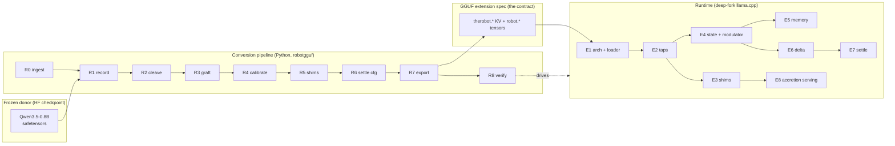
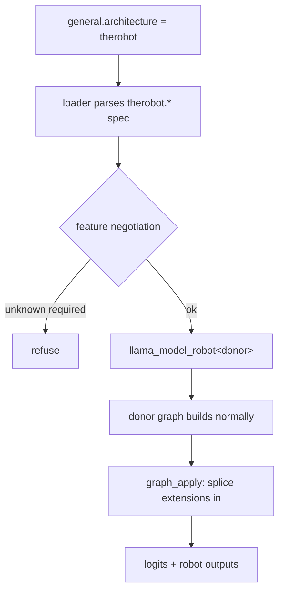
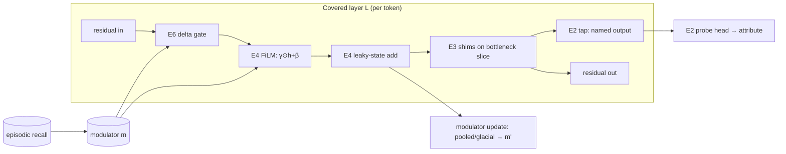
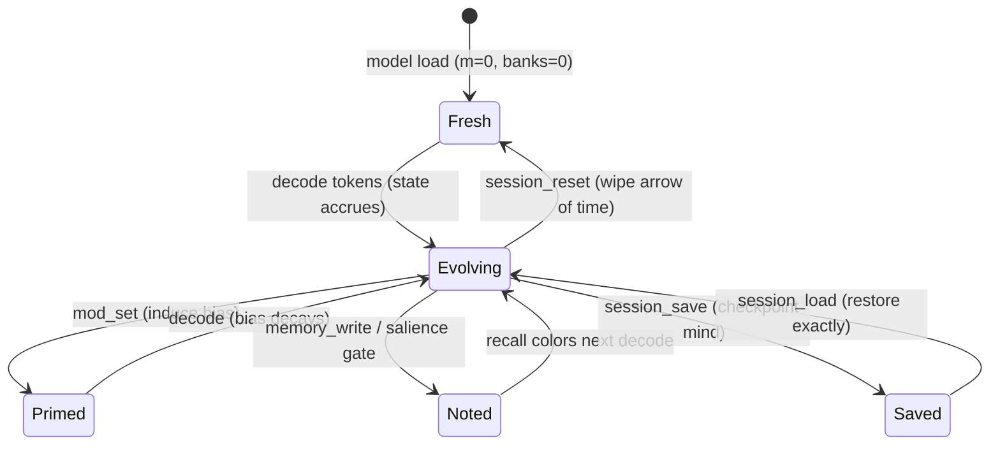
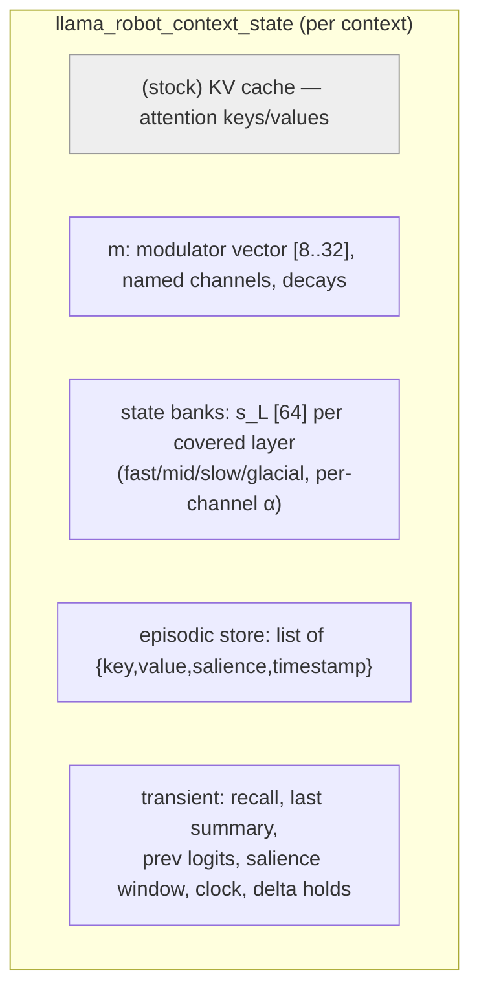
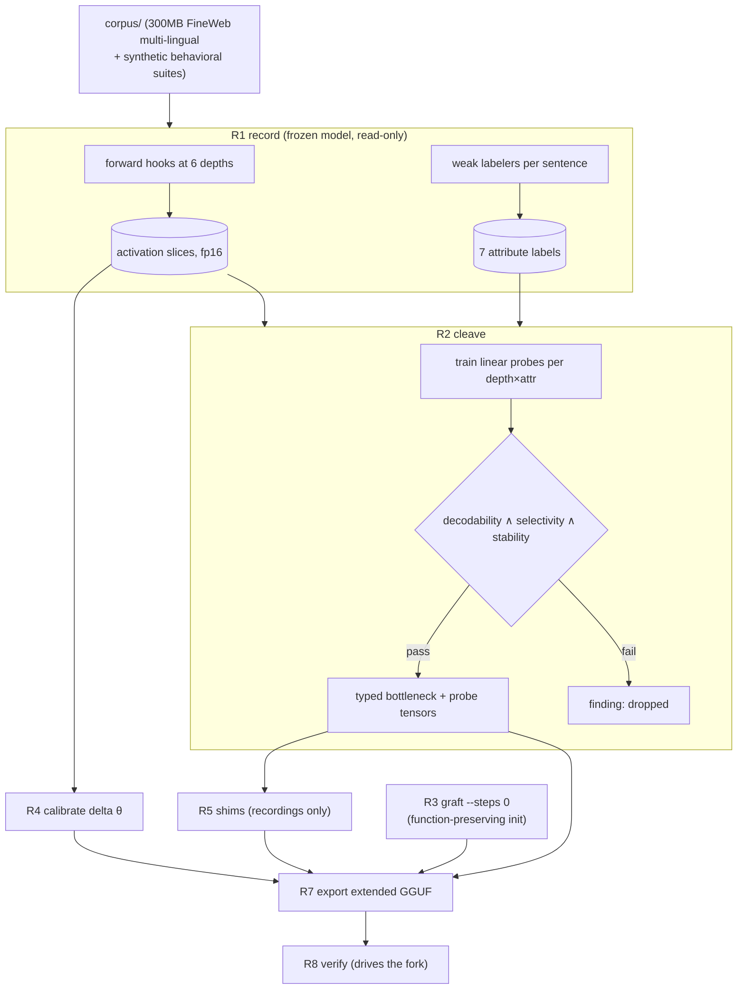
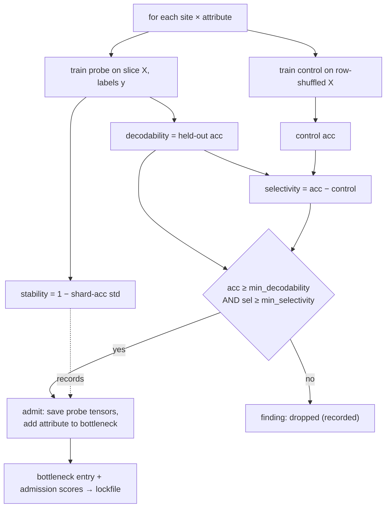

# therobot — Overview

**Status:** runtime + conversion pipeline implemented and validated on a real
donor (Qwen3.5‑0.8B); training-side stages and quality studies pending. The
corpus scale‑up + vectorized extraction track (**semvec**, the standardized
readout layer) is designed AND its conversion-side core is implemented —
stratified corpus loader, semvec/v1 spec + tiered labelers, vector cleave
with the per-site readout/overlay pair — with donor configs for
Qwen3.5‑0.8B, Qwen3.5‑9B, and Qwen3.6‑35B‑A3B. See
[`extraction-v1.md`](extraction-v1.md) (§9 for next steps).
**Last updated:** 2026‑07‑08.
**Scope of this document:** what was built, why, how, and what we expect it to
buy us — an executive summary followed by an engineering deep‑dive with
diagrams.

---

## 1. Executive summary

### What this is

therobot adds four runtime mechanisms to an **existing, frozen** language model
without retraining it: persistent state (an "arrow of time"), a top‑down
modulation bus (mood/priming), hot‑swappable behavior modules, and episodic
memory. The model's weights are never touched; the mechanisms are grafted on
top and start as no‑ops, so a converted model's *outputs* are bit‑exact to the
original's until you deliberately engage them. (The converted file itself is a
strict superset — donor tensors unchanged, plus dormant `robot.*` additions.)

### Why

Bigger models cost more to run, are harder to self‑host, and improve only by
expensive retraining that risks regressing what already works. The premise here
is that a compact model's ceiling is set less by parameter count than by
missing *mechanisms* — it cannot carry state across tokens, cannot be steered
except by prompt, cannot specialize without a fine‑tune, and cannot remember
within a session. Adding those mechanisms cheaply, to a model you already have,
is a different lever than scaling up: capability per parameter, controllability,
and the ability to accrete skills as governed modules instead of monolithic
retrains.

### Desired outcomes

- **More capable small models** — a compact model that carries state, primes,
  remembers, and specializes behaves beyond its size.
- **Behavior as a controlled variable** — steer by a named, decaying,
  inspectable dial rather than by prompt hope; read the model's internal state
  live.
- **Capability that accretes without regression** — add skills as admitted
  modules routed per request, with a *checked* guarantee the base model never
  degrades.
- **Faster inference on self‑host hardware** — spend compute only where the
  input actually changes; trade sequential depth for parallel refinement.
  (v1 proves the semantics and measures the ceiling via the compute trace; the
  physical compute‑skip that converts it into wall‑clock speedup is a deferred
  optimization — see E6/E7.)
- **All of it as a strict, reversible superset** — a logit‑exact parity
  guarantee means the downside is bounded: worst case you gain runtime
  interpretability and deterministic steering for free.

### What was built

Two interlocking deliverables, meeting at one contract:

1. **A deep fork of llama.cpp** (`3rd-party/llama.cpp`) that adds a new
   architecture family, `therobot`, wrapping any donor model (llama, qwen2/3,
   **qwen35**, mamba, …) and layering eight capability tiers on top of the
   frozen donor graph — taps, shims, state banks, a modulator bus, episodic
   memory, a delta executor, a settling decoder, and per‑request module
   routing. Work packages **E1–E8**, all implemented, each with a standalone
   test.

2. **A Python conversion pipeline** (`projects/therobotgguf/convert`,
   `robotgguf`) that retrofits an existing HF checkpoint onto the runtime by
   *discovering* structure in the frozen model and *grafting* zero‑effect
   additions — stages **R0–R8** (R6 is *settle*: a config passthrough in v0,
   since the settling decoder's mdlm objective waits on a diffusion‑class
   donor — see §3.3 E7).

They meet at the **GGUF extension spec** (`therobot.*` metadata + `robot.*`
tensors), the single contract both sides implement.

### The extensions, and why each should improve the model

Eight runtime extensions (E1–E8). E1 is plumbing; each tier after it attacks a
specific limitation of a stock feedforward transformer and carries a concrete
performance hypothesis. (E4 is one package contributing *two* grafted
mechanisms — state banks and the modulator bus — listed separately below.)

- **E2 — Taps & probes (introspection).** *What:* named read‑outs of the
  model's own hidden activations at chosen depths, plus tiny linear heads that
  decode a human attribute (topic, register, threat‑salience, …) from them.
  *Why it should help:* it turns opaque internal state into an inspectable
  interface. On its own it doesn't change outputs — but it is the prerequisite
  for *safe* steering (you cannot surgically edit a representation you can't
  locate and isolate) and for runtime guardrails that react to what the model
  is actually representing rather than to its text.

- **E3 — Shims (surgical behavior control).** *What:* small, hot‑swappable edits
  applied to one typed bottleneck slice — misreport/steer a single attribute
  while holding the rest fixed. *Why it should help:* behavior becomes a
  controlled variable instead of a prompt gamble. A "be more formal" or "damp
  threat salience" module is a measured, reversible edit at the exact place that
  attribute lives, admitted only if it moves its target and leaves others
  intact. Compact models are hard to steer by prompt alone; a precise handle on
  the representation is a stronger lever.

- **E4 — Leaky state banks (an arrow of time).** *What:* per‑layer recurrent
  side‑channels that carry a decaying summary of recent activity across tokens.
  *Why it should help:* a stock transformer is stateless per position — it
  reconstructs "what just happened" from the context window every step, which
  costs context length and attention compute. Cheap persistent state lets a
  small model encode motion, causality, and slow‑burn reassessment (evidence
  that accumulates and flips an interpretation late) far more compactly. **The
  central capacity‑per‑parameter bet.**

- **E4 — Modulator bus + FiLM (mood / priming).** *What:* a low‑dimensional,
  named global state (arousal, valence, attention, safety, …) that decays toward
  baseline and, via FiLM gain/bias, reshapes every covered layer's computation.
  *Why it should help:* it gives the model a controllable, self‑relaxing "mood"
  — raise arousal and threat‑relevant features get amplified, then fade. This is
  priming as a mechanism: a dial you can set (and that memory/recall can set for
  you), with a known half‑life, rather than a static instruction.

- **E5 — Episodic memory (in‑session learning).** *What:* a salience‑gated store
  of noteworthy moments whose content‑addressed recall feeds back into the
  modulator on later tokens. *Why it should help:* it gives one‑shot behavioral
  adaptation *within a session, without any weight update* — a striking event
  colors subsequent processing and then fades on its designed schedule. That is
  a form of learning at inference the base model cannot do.

- **E6 — Delta executor (spend compute where it matters).** *What:*
  change‑triggered execution — blocks whose input barely changed contribute a
  held output instead of recomputing, with periodic dense "heartbeat" sweeps to
  bound drift. *Why it should help:* in streaming decode most of the network's
  input is near‑stationary token to token, so most block executions recompute
  what they already know. Skipping the quiet ones cuts inference cost at bounded
  quality loss — and because the modulator lowers firing thresholds, an
  "aroused" model spends *more* compute exactly when it should.

- **E7 — Settling decoder (difficulty‑proportional compute).** *What:* a
  canvas‑based parallel refinement loop that iterates until the output stops
  changing, with modulator‑scheduled depth. *Why it should help:* it trades
  sequential decoding depth for parallel refinement rounds — easy spans settle
  in few rounds, hard ones take more, so compute scales with difficulty rather
  than with length.

- **E8 — Accretion serving (capability without regression).** *What:* a registry
  of admitted shim modules with tags and a dependency graph, routed per request
  and hot‑swapped on a resident model. *Why it should help:* it makes capability
  *accrete* — new skills arrive as governed modules selected per request, with a
  checked guarantee that routing to nothing is bit‑identical to the untouched
  model. Improvement becomes a software‑engineering problem (composable,
  versioned, reversible) instead of a monolithic retrain that risks forgetting.

The through‑line: **discover** structure the frozen model already has (E2), and
**graft** mechanisms it lacks (E3–E8), every one of them starting as a no‑op so
the base model is provably untouched until engaged.

### The non‑negotiable invariant

Every extension is **function‑preserving at insertion**. With all additions at
their initial state, a converted model is **behaviorally bit‑exact to the
donor** — proven, not asserted: the runtime's parity gate (validation runbook,
`3rd-party/llama.cpp/docs/robot/`) reports `max |logit diff| = 0` on
Qwen3.5‑0.8B across all 248,320 vocabulary logits. This is what makes it a
*retrofit* rather than a fine‑tune: you never change what the model knows, you
add a nervous system that observes and gently steers.

### Hypotheses of impact

| # | Hypothesis | Mechanism | How it's tested |
|---|---|---|---|
| H1 | State banks let a compact model encode time/causality more compactly than a same‑size feedforward baseline | E4 leaky state (§3.3) | R3 temporal suite: slow‑burn tasks where late evidence must flip an interpretation |
| H2 | A modulator bus gives controllable, decaying behavioral priming | E4 modulator + FiLM (§3.3) | Induce‑and‑relax: set `m[arousal]`, watch bias appear and decay (proven in‑fixture) |
| H3 | Typed bottlenecks expose isolated attribute subspaces that can be edited surgically | E2 taps + E3 shims (§3.3) | Cleave selectivity + shim admission (move target, hold others) |
| H4 | Salience‑gated memory gives one‑shot in‑session behavior change that decays | E5 episodic memory (§3.3, §3.6) | One write changes next decode, fades to <5% of peak — **proven in‑fixture** |
| H5 | Change‑triggered execution cuts streaming compute at bounded quality loss | E6 delta executor (§3.3) | Keep‑rate vs quality; heartbeat‑bounded divergence — **exact schedule proven** |
| H6 | Capability accretes as governed modules without core regression | E8 registry + routing (§3.3) | Zero‑forgetting gate: route→∅ is bit‑identical to never‑routed — **proven** |

The mechanisms are all implemented and unit‑proven on fixtures; whether the
*quality* gains (H1, H3, H5 at scale) materialize on real donors is exactly
what the R‑stage gates on real hardware exist to measure. A failed hypothesis
is a recorded finding that branches the plan, not a silent patch.

---

## 2. System at a glance



The donor is converted once; the extended GGUF loads in the fork; the fork
serves it with the extensions negotiated per file and toggled per context.

---

## 3. The runtime — engineering deep‑dive

### 3.1 Architecture family, not per‑donor arches

One arch (`LLM_ARCH_THEROBOT`) is registered. Its `therobot.base_architecture`
KV names the wrapped donor family. A template wrapper
`llama_model_robot<TDonor>` inherits the donor's model class and dispatches
hparams/tensors/graph to it, running internally **as** the donor arch (so every
base behavior — rope type, KV layout, chat template — is the donor's,
unchanged). Extensions are layered at explicit insertion points. This keeps the
donor surface open‑ended without an enum explosion and keeps stock files
byte‑identical to upstream (the *superset invariant*: the upstream test suite
must stay green in the fork).



### 3.2 The residual stream as a shared bus

Everything hangs off one fact: the transformer's **residual stream** is a bus
every layer reads from and writes to. Extensions *read* it (taps, probes,
memory summaries, the modulator's pooled source) or *write into it* (FiLM,
state, shims, delta blend) — always in the donor's own representational space,
so the frozen downstream layers consume the edited stream as ordinary input,
needing no retraining.



### 3.3 Per‑package deep‑dive

Each package below is one self‑contained capability tier: what it is, why a
stock transformer needs it, and how it is implemented in the fork. Source
lives in `src/llama-robot-*.{h,cpp}`; the public surface is
`include/llama-robot.h`.

---

#### E1 — Architecture family + spec loader

**What.** The entry point for every therobot file. A GGUF whose
`general.architecture = therobot` is loaded, its `therobot.*` metadata parsed
and *negotiated*, and — if accepted — a wrapper model is instantiated that
runs the wrapped donor while exposing insertion points for the other seven
tiers. `robot-inspect` is the companion tool that dumps a file's manifest
without running it.

**Why.** Two constraints pull against each other. First, the runtime must
support an open‑ended set of donor families (llama, qwen2/3, **qwen35**,
mamba, …) without a combinatorial explosion of per‑model code and without a
new enum value per donor. Second — the non‑negotiable one — stock files and
stock architectures must behave *byte‑identically* to upstream llama.cpp (the
"superset invariant"), so that adopting the fork is risk‑free and upstream
rebases stay mechanical. A single new arch that *wraps* donors, rather than a
family of new arches, satisfies both.

**How.** One arch id, `LLM_ARCH_THEROBOT`, is registered. `therobot.base_architecture`
names the donor family. The loader (`llama-robot-hparams`) reads the KV
contract in three passes: (1) identity + spec version — a file whose
`spec_version` exceeds what this build implements is refused outright; (2)
**feature negotiation** — `therobot.features` lists *required* features and the
loader refuses any it does not implement (running a required feature degraded
would be a silent correctness bug), while unknown *optional* features are
ignored so older runtimes tolerate newer files; (3) per‑feature sections
(bottlenecks, state banks, modulator, memory, delta, settle) parsed only for
negotiated features. The factory then rebinds the loader's per‑arch KV
formatting to the *donor* family and constructs the template wrapper
`llama_model_robot<TDonor>` — which inherits the donor's model class, so hparam
loading, tensor loading, rope type, KV‑cache layout, and chat template are all
the donor's, unchanged. Extension tensors (`robot.*`, `blk.*.robot_*`) are
claimed during load so the tensor‑count bookkeeping stays exact. The net effect:
the model runs *as* the donor internally, with therobot behavior layered at
explicit, fenced insertion points, and an L0 (empty‑feature) file is provably
the donor.

---

#### E2 — Taps + probe heads (introspection)

**What.** A tap is a live read‑out of the model's hidden activations at a
declared depth and channel range — the runtime exposes the raw slice
(`llama_robot_tap_read`) and, on request, decodes a human‑meaningful attribute
from it with a small probe head (`llama_robot_probe_eval`). This is the
model's own internal state made queryable during generation.

**Why.** Everything else in therobot either reads the model's representation
(memory summaries, the modulator's pooled source, shim gates) or writes into
it (shims, FiLM, state). None of that is safe or even definable without a
*stable, isolated, machine‑readable* handle on where a given concept lives.
Taps are that handle. They also stand alone as an interpretability tool:
instead of asking the model to self‑report in text (which it can do
unreliably), you decode what it is actually representing — "the model
currently reads this as formal / a question / threat‑salient" — token by token.

**How.** After the donor graph is built, `llama_robot_graph_apply` locates each
declared cleave‑point tensor by name (`l_out-L`, `attn_out-L`, or `ffn_out-L`,
the names llama.cpp's graph callback already assigns), slices the declared
channel range with `ggml_view`, makes it contiguous with `ggml_cont`, names it
`robot_tap-i`, and marks it a **graph output**. This is deliberately *not* an
eval‑callback hook (which is fragile and order‑dependent) — it is a first‑class
output node, so the scheduler treats it like the logits: computed, allocated,
and stable under graph reuse. Because a tap is a pure additional output, it
cannot perturb the logits — proven by the tap test's bit‑exact parity with
taps active. After a decode, `tap_read` copies the most recent position's slice
back to the host. Probe heads are the small linear decoders trained by the
conversion pipeline (§4.4) and shipped as `robot.probe.*` tensors; they are
evaluated only when the caller asks, as a host‑side matvec. Precisely: a
*declared* tap carries a small always‑on cost (its slice view + contiguous
copy runs every decode); *probe evaluation* costs nothing unless used.

---

#### E3 — Shims (surgical behavior control)

**What.** A shim is a small, slice‑scoped, hot‑swappable edit to one typed
bottleneck: nudge a single attribute (formality, threat‑salience, topic bias)
while provably leaving the rest of the representation intact. Shims ship as
standalone `therobot-shim` GGUF modules, attach and detach per context, and
compose.

**Why.** Compact models are hard to steer by prompt alone, and a prompt is a
blunt, global instrument — it changes everything downstream and can't be
verified. A shim is the opposite: a measured, reversible edit at the exact
location an attribute is represented (found and validated by cleave), admitted
only if it moves its target and holds the others fixed. This turns behavior
into a *controlled variable* rather than a prompt gamble, and it is the unit of
the accretion economy (E8) — capability you can add, route, and remove per
request.

**How.** The edit on the slice `x` is FiLM‑shaped: `y = gain ⊙ x + steer +
B(A·x)` (any of the terms may be absent — a pure steering vector is the common
case), applied to the full stream as `out = x + g·(y − x)`. The gate `g ∈
{0,1}` is computed **in‑graph** — `step(w·x + b)` for a probe gate, `step(m[c]
− v)` for a modulator gate — with the comparison folded into an effective bias
at load. Computing the gate in the graph is the key trick: the graph
*topology* stays fixed while the edit toggles per token, which is what keeps
llama.cpp's graph‑reuse valid (a data‑dependent topology would force a rebuild
every token). The edit is spliced into the donor graph by rewiring cgraph node
inputs: the replacement tensor is expanded into the graph, every downstream
consumer of the original slice is re‑pointed at it, execution order is restored
by moving the new nodes after their source, and ggml's use‑counts are adjusted
to match. Per context, a shim set is tracked with an **epoch** that is keyed
into the graph‑reuse parameters, so attaching or detaching forces exactly one
rebuild and reuse never serves a stale graph. Registry metadata
(`depends`/`conflicts`) is enforced at attach; detach is refused while a
dependent is still attached.

---

#### E4 — Leaky state banks + modulator + FiLM (state & mood)

**What.** Two grafted mechanisms that a feedforward transformer structurally
lacks: per‑layer **leaky state banks** (a decaying, multi‑timescale running
summary of recent activity — the "arrow of time") and a per‑session
**modulator bus `m`** (a small, named, self‑decaying global state that reshapes
computation through **FiLM** gain/bias at each covered layer). Together they
are the session's checkpointable "mind."

**Why.** A stock transformer is stateless within a forward pass: each position
is processed fresh, and the only cross‑token memory is the KV cache plus the
finite context window. That forces a compact model to *reconstruct* "what just
happened" every step, spending context length and attention compute on it. A
leaky state bank encodes that cheaply and persistently — motion, causality, a
slow‑burn reassessment that accumulates over many tokens and flips an
interpretation late. Separately, a model has no controllable global state — no
"mood" — that biases how it interprets input; the modulator adds one, with a
known decay so any excursion relaxes. These two cannot be bolted on from
outside the forward pass the way taps/shims/memory can; they require new
recurrence and new gain‑modulation *inside* it. This is the central
capacity‑per‑parameter bet.

**How.** Per covered layer `L`, the leaky state is a diagonal EMA
`s_L ← σ(α)·s_L + (1−σ(α))·in_proj(h_L)`, with per‑channel decay `α` grouped
into banks (fast/mid/slow/glacial); its contribution `out_proj(states)` is
added back into the residual stream, and `out_proj = 0` at graft so the whole
branch is a no‑op until trained (the function‑preserving invariant). The scan
is unrolled per position over the ubatch (a diagonal recurrence, cheap and
parallelizable). The modulator `m` is produced each decode from a pooled
projection of the final stream (or the glacial bank slice) through a small
GRU/MLP with per‑channel decay toward baseline; FiLM heads apply
`(γ_w·m + γ_b) ⊙ h + (β_w·m + β_b)` per covered layer, at identity init
(γ‑bias = 1, everything else 0). Host‑side state enters each decode as graph
*input* tensors (pushed at set‑input time, so they update on reused graphs too)
and is captured back after compute. The whole thing serializes via
`session_save/load` (fork, roll back, or migrate a "mind" as a byte blob) and
can be wiped mid‑session with `session_reset` — independent of the KV cache.
v1 scope: one recurrent state per context (batch‑1 streaming), state on the
final layer refused (its rows are output‑filtered). §3.5 inventories all of
this per‑context state in plain terms.

---

#### E5 — Episodic memory (in‑session adaptation)

**What.** A per‑context store of noteworthy moments whose content‑addressed
recall biases future processing — giving one‑shot behavioral change that
decays, with no weight update.

**Why.** The base model cannot learn within a session: nothing it sees changes
how it behaves a hundred tokens later except through the context window. A
salience‑gated episodic store adds exactly that — a striking or surprising
event is written, and its recall colors subsequent processing and then fades on
a designed schedule. This is the notes' "traumatic or noteworthy event that
alters functioning while recent," and it is a genuine form of inference‑time
adaptation the frozen model has no analogue for.

**How.** Pure runtime, CPU‑side, no graph changes. The store holds entries
`{key, value, salience, timestamp}` where keys/values are learned memory‑head
projections of the *bottleneck summary* (the concatenated tap slices at the
last position). Each decode runs a six‑step loop: **summarize** the tap
slices; score **salience** (a learned linear gate over
`[surprise, ‖m‖, m₀ … m_{M−1}]` — importance, not just surprise); **gate** the
write on a session‑relative quantile *and* an absolute floor; **write**
(evicting the lowest‑retention entry if full); **recall** by content match ×
recency; and **inject** the recall (which lives in modulator space —
`value_dim == modulator dim`, enforced at load) into the *next* decode's
modulator update. So a past event reaches the present one step behind, through
the same mood dial the rest of the system uses, and decays as both the memory
ages and `m` relaxes. The full loop — every formula, and the reasoning behind
the salience gate and the dual write bars — is traced step by step in §3.6.
Proven behavioral signature (Hypothesis 4): one write moves the next decode,
rises to a peak, then decays monotonically to <5% of peak while the memory
itself persists. The store rides the session checkpoint and exports as JSON
(`memory_export`) for offline consolidation.

**Memory bandwidth = modulator width.** Because recall injects into `m`, a
memory's *value* is a modulator‑space vector (`value_dim == modulator dim`), so
the width of the modulator bus is exactly how much content one memory can carry.
The first channels are the named, interpretable mood dials (arousal, valence,
safety …); the remaining dims are an **unnamed latent space** that the value
head can embed richer content into and FiLM projects back into the residual
(`n_embd`). Widening the modulator (e.g. 8 → 32) therefore widens memory from a
pure mood dial toward genuine content recall, at the cost of more parameters in
the FiLM and value projections; narrowing it back to the named channels gives
pure affect. Everything downstream (FiLM γ/β, the value head) is sized by this
one number, so it is a single conversion‑time knob.

**Relation to attention.** Episodic memory *is* content‑addressed retrieval —
query·key similarity then a weighted combination of values — so structurally it
is a cousin of an attention head. The differences are what make it a distinct
mechanism rather than another head: attention keeps *every* token's K/V for the
life of the context window (dense, ephemeral, in‑band, full softmax, wiped at
the window boundary), whereas episodic memory keeps *one compressed summary per
salience‑gated event*, persists across the whole session and to disk, decays on
a designed forgetting curve with capacity eviction, retrieves by recency‑
weighted cosine top‑k, and injects its read one step behind through the
modulator side‑channel. In short: an attention head is working memory — dense,
high‑bandwidth, ephemeral; this store is long‑term memory — sparse, curated,
decaying, persistent. Architecturally it is closer to an external retrieval
memory (kNN‑LM, Memorizing Transformers, RETRO) than to a per‑layer head: the
trade is fidelity for reach — attention is far sharper inside its window;
episodic memory is what lets a moment survive past it.

---

#### E6 — Delta executor (change‑triggered compute)

**What.** Change‑triggered execution for streaming decode: a covered block
whose input barely moved since it last fired contributes a *held* output
instead of recomputing, with periodic dense "heartbeat" sweeps to bound drift
and a per‑token compute trace.

**Why.** In autoregressive streaming, most of the network's input is nearly
stationary token to token — yet a dense forward pass recomputes every block
every step, redoing work whose result barely changes. Spending compute only on
the blocks whose input actually shifted cuts inference cost at bounded quality
loss. And because the modulator lowers firing thresholds (excitability), an
"aroused" model spends *more* compute exactly when the situation is
threat‑ or novelty‑laden — compute allocation that tracks the model's own
sense of what matters.

**How.** Per covered block, `fire = step(mean((x − held_in)²) − θ_eff)` with
`θ_eff = θ_base + fatigue − excitability·m`. A firing block refreshes its held
input/output; a quiet block contributes its held output, blended as
`out = held_out + fire·(block(x) − held_out)`. A dense **heartbeat** sweep every
`therobot.delta.heartbeat` tokens forces all blocks to fire, re‑anchoring the
held state and bounding how far the held approximation can drift; the interval
is chosen from the calibrated divergence curve. Fire decisions are read back
per token as the compute trace the tests require (per‑block fire counts, keep
rate = effective executions / (tokens · blocks)). Off by default (a deliberate
risk posture). v1 scope note: blocks still *execute* — the fire flag gates whether
their output enters the stream — which yields exact delta semantics, the full
trace, and bounded‑divergence behavior; the *physical* skip of quiet blocks is
the shared‑executor optimization deferred alongside E7, with the compute trace
already reporting the ceiling as effective FLOPs. Prompt ubatches (T > 1)
always run dense; the first streaming token after a prompt re‑forces a dense
sweep so held state re‑initializes cleanly.

---

#### E7 — Settling decoder (iterative refinement)

**What.** A canvas‑based parallel decode: draft all output positions at once,
then iterate — re‑deciding every position from the current canvas — until the
canvas stops changing, with modulator‑scheduled settling depth. Built on the
same *iterate‑until‑quiet* executor E6 uses.

**Why.** Standard autoregressive decoding is strictly sequential — each token
waits on all prior tokens — so latency scales with output length regardless of
how "easy" the span is. A settling loop trades that sequential depth for
parallel refinement rounds: easy spans converge in a few rounds, hard ones take
more, so compute becomes proportional to *difficulty* rather than length. It
also lets the therobot machinery operate on the whole molten output at once —
taps readable mid‑settle, shims editing the canvas, the leaky state persisting
across rounds as an un‑commit escape hatch.

**How.** The canvas loop runs on `llama-robot-executor`, the shared control
structure (a loop with a change metric, an ε threshold, a step cap, and
post‑quiet re‑check rounds) that E6 instantiates across tokens and E7 across
settling rounds — implementing the custom‑runtime risk exactly once. Each
round: drop the canvas region from the KV state, re‑decode the whole canvas in
one batch (every position emits logits), re‑draft each position, and measure
the fraction of positions that changed; quiet when ≤ ε, then a
modulator‑scheduled number of extra re‑check rounds (anxious → deeper
settling), under a step cap. v1's `jacobi-ar` objective re‑drafts position *j*
from position *j−1*'s logits — Jacobi iteration on the greedy decoding fixed
point — so on a causal donor the settled canvas is *provably equal to greedy
AR output*, which is what makes the machinery testable (bit‑exact vs greedy)
without a diffusion checkpoint. Masked‑diffusion (`mdlm`) objectives, and the
server/CLI settle surface, wait on a diffusion‑class donor.

---

#### E8 — Accretion serving (governed module economy)

**What.** A registry of admitted shim modules with task tags, admission scores,
and a dependency graph, routed per request onto a resident model and
hot‑swapped without teardown — plus the export of memory traces as raw material
for building the next modules.

**Why.** Improving a model normally means fine‑tuning: expensive, risky to
what already works, and producing a new monolith to re‑validate wholesale.
Accretion makes capability a *governed module economy* instead — new skills
arrive as admitted shims, selected per request, with a **checked** guarantee
that the base model never regresses. Improvement becomes a software‑engineering
problem: composable, versioned, reversible, testable in isolation, with
validation cost that grows linearly per module rather than requiring a full
re‑validation each time. And because sessions export their memory traces, the
system's day job produces the raw material for its own next modules.

**How.** A `registry.json` (maintained by the converter tooling) indexes
admitted modules per model hash with their tags, admission scores, and
`depends`/`conflicts` edges. `llama_robot_route` takes a request's task tags
and computes the module set: tag selection → dependency closure
(auto‑include) → conflict resolution (first‑admitted‑wins, dependents of a
dropped module drop with it) → hot‑swap onto the context over the E3
attach/detach machinery, detaching de‑selected modules in dependency‑safe order
and attaching the selection dependencies‑first, with module files streamed in
lazily on first use while the core stays resident. The **zero‑forgetting
invariant** is a permanent CI gate: routing to an empty tag set produces
outputs *bit‑identical* to a never‑routed context (proven). `memory_export`
writes the episodic store with provenance as JSON; the offline consolidation
pipeline distills those traces into new shim modules that re‑enter through the
registry — closing the loop from runtime experience back to installable
capability. Module *integrity* — signing, provenance beyond model‑hash keying,
tamper‑resistance of `registry.json` — is deliberately out of scope in v1 (the
registry is a local, trusted artifact) and is the obvious hardening item
before third‑party modules are ever admitted.

### 3.4 Session lifecycle & control surface



Public C API (`include/llama-robot.h`): tap read + probe eval; shim
init/attach/detach; `mod_get/set`; `memory_write/forget/recall/export`; delta
enable + compute‑trace; `settle`; registry load + `route`; session
`size/save/load` and **`session_reset(forget_memory)`** to clear the leaky
state without reloading the model.

### 3.5 What state the runtime carries (beyond the KV cache)

A stock llama.cpp context holds exactly one piece of per‑session state: the
**KV cache** (the attention keys/values for tokens seen so far). therobot adds
a second, parallel bag of per‑context state — the *recurrent* state — that the
KV cache does not contain and that a stock model has no equivalent of. It lives
host‑side in one structure per context (`llama_robot_context_state`) and is
distinct from, and orthogonal to, the KV cache: `llama_memory_clear` wipes the
KV cache; `llama_robot_session_reset` wipes the recurrent state; the two are
independent.

Concretely the recurrent state holds:

**1. The modulator vector `m` — the global "mood".**
A small dense vector, dimension 8–32, with *named* channels (in the Qwen3.5
config: arousal, valence, attention, safety, novelty, focus, warmth, energy).
It is one vector for the whole session (not per token, not per layer). Each
decode it is updated from pooled activations (or the glacial state bank) and
**decays per‑channel toward zero**, so any excursion relaxes on its own. It is
the thing `mod_get`/`mod_set` read and write, and the thing FiLM turns into
per‑layer gain/bias. Think of it as a handful of slow‑moving scalars that
color the entire network's computation.

**2. The leaky state banks — the "arrow of time" accumulator.**
For each covered layer `L`, a vector `s_L` of width Σ(bank widths) — in the
Qwen3.5 config, 24+24+8+8 = 64 floats per covered layer, at layers 6/12/18.
Each element belongs to a *bank* with its own learned decay rate `α`:

  - **fast** channels (low α) hold roughly the last token or two — foreground,
    executive;
  - **mid / slow** channels integrate over longer spans;
  - **glacial** channels (α near 1) hold a very long‑horizon summary and are the
    modulator's input source.

The update is a leaky exponential moving average over the token stream:
`s_L ← σ(α)·s_L + (1−σ(α))·in_proj(h_L)`. So `s_L` is literally an accumulator:
a decaying, multi‑timescale running summary of what this layer has been seeing.
That is the "arrow of time" — a stateless transformer has nothing like it;
here, "what just happened" is a concrete 64‑float vector per covered layer that
biases the current computation via `out_proj(s_L)` added back into the stream.
It carries across tokens *and* across the settling decoder's inner rounds
(where it doubles as the un‑commit escape hatch).

**3. The episodic store — long‑term noteworthy events.**
A capacity‑bounded list of entries, each
`{key: float[key_dim], value: float[value_dim], salience: float, timestamp: uint64}`.
Keys and values are memory‑head projections of the *bottleneck summary* (the
concatenated tap slices). This is the only state meant to persist across many
tokens and to survive a `session_reset` (unless you pass `forget_memory`). It
is genuinely a small database, not a fixed‑width buffer.

**4. Transient bookkeeping.**
The current `recall` vector (what memory is whispering into the next decode),
the last bottleneck `summary`, the previous decode's logits (the basis for the
surprise signal), a running salience window (for the quantile write‑gate), a
token clock, and — when delta is enabled — per‑block *held* input/output
vectors plus fatigue counters.



### 3.6 Episodic memory, step by step

Memory turns "something noteworthy just happened" into a lasting, content‑
addressable nudge on future processing — without any weight update. Each decode
runs this loop (host‑side, after the graph computes):

```mermaid
sequenceDiagram
    participant D as decode(token)
    participant S as summary (tap slices)
    participant G as salience gate
    participant ST as episodic store
    participant R as recall
    participant M as modulator m (next decode)

    D->>S: read bottleneck slices → summary vector
    D->>G: surprise = −log p(token | prev dist);  s = w0·surprise + w1·‖m‖ + Σ w·m_c
    G->>G: s > 0 AND s ≥ max(quantile(window), floor)?
    alt gate fires (or explicit memory_write)
        G->>ST: write {key=Kw·summary, value=Vw·summary, salience=s, t=clock}
        ST->>ST: if full, evict lowest salience·2^(−age/halflife)
    end
    D->>R: query = Kw·summary
    R->>ST: cosine top-k, recency-weighted by 2^(−Δt/halflife)
    ST-->>R: weighted mean of matching values
    R->>M: inject recall into NEXT decode's modulator update
```

Reading the loop:

1. **Summarize.** After the decode, the bottleneck tap slices (last position)
   are concatenated into a `summary` vector — a compact snapshot of what the
   model just represented.
2. **Score salience — importance, not just surprise.**
   `salience = w₀·surprise + w₁·‖m‖ + Σ_c w_{2+c}·m_c`. *Surprise* (negative
   log‑probability of the arrived token) is the free bootstrap signal, but it
   flags the *startling*, not the *important* — a rare glyph spikes it; "allergic
   to penicillin" does not. So salience is a learned linear gate that also reads
   the modulator: *‖m‖* (overall arousal) plus, optionally, each named
   **importance channel** (threat, valence, novelty, goal‑relevance). A calm
   moment carrying a high‑threat or high‑valence internal state is retained even
   at low surprise; a startling‑but‑trivial one is dropped. Weights ship in
   `robot.mem.salience.weight` (length 2 = surprise+‖m‖; length `2+M` also
   weights every channel; absent = defaults 1,1). A fully learned head over the
   summary *content* is the R5 upgrade.
3. **Gate the write.** Salience must be positive and clear **two** bars at once:
   a running **quantile** over recent scores (so "noteworthy" is relative to the
   session's own baseline) **and** an absolute `salience_floor` (0 = off). The
   quantile alone always writes the top `(1−q)` of decodes — a constant trickle;
   the floor lets a whole quiet stretch record nothing, so writes are *rare AND
   meaningful*. Explicit `llama_robot_memory_write` bypasses the gate — the
   caller declaring "this moment matters."
4. **Write.** Store `{key = Kw·summary, value = Vw·summary, salience,
   timestamp}`. Keys and values are separate learned projections of the same
   summary. If the store is full, evict the entry with the lowest *retention*
   score `salience · 2^(−age/halflife)` — old, unremarkable memories go first.
5. **Recall.** Project the *current* summary into query space, score every
   stored entry by `cos(query, key) · 2^(−Δtokens/halflife)` (content match ×
   recency), take the top‑k, and produce a recency‑weighted mean of their
   values. Recent, well‑matching memories dominate; everything fades.
6. **Inject.** The recall vector (which lives in modulator space —
   `value_dim == modulator dim`, enforced at load) is added into the
   **next** decode's modulator update. So a past event reaches the present one
   step behind, through the same mood dial the rest of the system uses, and then
   decays as both the memory ages and `m` relaxes.

The net behavioral signature (Hypothesis 4, proven in‑fixture): a single write
changes the next decode, the effect rises to a peak while the memory is fresh,
then decays monotonically to <5% of peak as recency weighting and modulator
decay take over — while the memory itself remains in the store. The whole
store, plus `m`, the banks, and the clock, serialize into the session
checkpoint (`session_save`), so a "mind" can be forked, rolled back, or
migrated as a byte blob; `memory_export` dumps it as JSON for the offline
consolidation pipeline.

### 3.7 Fork hygiene

All extension code lives in new `llama-robot-*` files; every touch inside an
upstream file is fenced (`ROBOT-EXT-BEGIN/END`) and enumerated in
`docs/robot/patch-points.md` (16 fences total), so upstream rebases are a
mechanical checklist. The superset invariant is a permanent gate.

---

## 4. The conversion pipeline — engineering deep‑dive

### 4.1 Principle

The donor core is **frozen from the moment of recording**. Every added
parameter trains against recordings or with the core frozen; every graft is
zero‑effect at insertion. The pipeline either *discovers* latent structure or
*grafts dormant machinery* — nothing overwrites the donor.

### 4.2 Data flow



### 4.3 Why the corpus is shaped as it is

R2 measures whether each attribute is **decodable** and **selective** — and
that measurement is meaningless if the attribute never varies. So the corpus is
deliberately balanced across all seven axes: real multilingual FineWeb (for
`language`, topic, entity, register spread) plus a synthetic behavioral suite
for the sharp corners web text underrepresents (imperatives, threat‑salience,
register extremes). On a monolingual corpus, `language` collapses and cleave
correctly *drops* it — not for lack of signal but for lack of label variation.
The **selectivity** control (probe vs a shuffled‑feature baseline) is what
distinguishes real signal from class‑imbalance artifacts.

**v0 is a bootstrap corpus, not the destination.** 300MB of FineWeb plus
synthetic suites is enough to validate the apparatus, not to map a model. The
v1 corpus ([`extraction-v1.md`](extraction-v1.md) §2) is ~20GB across seven
domain strata — web, a ~10‑language multilingual spread, code (Stack‑Edu),
mathematics (FineMath), science (peS2o), literature (PG‑19), long‑form PDFs —
described by a provenance‑carrying manifest, so that cleave can (a) test
attributes that only vary across domains (code‑vs‑prose, formal‑proof
register, symbolic density), (b) admit bottlenecks that are stable *across*
domains rather than artifacts of web text, and (c) give the selectivity
control a harder, better‑balanced null. Domain balance matters more than raw
size — every attribute needs genuine variation, per this section's own
argument.

**A v0 caveat found while planning v1:** `record`'s corpus loader reads the
configured files head‑to‑tail and stops at the token budget, so the v0
recordings drew from roughly the first megabyte of `mixed-text.txt` — the
head of the English FineWeb stream. The behavioral suites and FineWeb‑2
language slices likely never entered the recordings (which is also *why* the
sandbox run was effectively monolingual and `language` was dropped). The v1
loader interleaves strata by share (extraction‑v1 C1) and the v0 admission
table gets re‑baselined on the fixed loader before any v0‑vs‑v1 comparison.
See §4.6 for the full extraction roadmap.

### 4.4 Feature extraction — how cleave finds and scores typed bottlenecks

Cleave is the introspection engine. It answers, for each recorded depth and
each attribute: *is this concept linearly present in the frozen model's
activations here, and is it present because the concept is there rather than
by accident?* Where the answer is yes, that (depth, channel‑slice) becomes a
**typed bottleneck** — a named, machine‑readable interface — and the trained
readout is exported as a `robot.probe.*` tensor the runtime can evaluate live.

**The probe.** For a site's recorded slice `X ∈ ℝ^{N×d}` (N token positions,
d = the site's configured slice width — 128 in the Qwen3.5 config) and an
attribute's integer labels `y ∈ {0..C−1}^N`, a probe is a multinomial logistic
regression trained by full‑batch gradient descent:

```
standardize:   x̃ = (X − μ) / σ            (μ, σ per channel)
model:         p = softmax(x̃·W + b)         W ∈ ℝ^{d×C}, b ∈ ℝ^C
loss:          cross-entropy + λ‖W‖²        (L2, λ = 1e-3)
```

Crucially the standardization is **folded back** into the exported weights so
the probe acts on *raw* activations at inference (the runtime has no μ/σ):

```
W_raw = W / σ            b_raw = b − (μ/σ)·W
probe(raw)  ≡  softmax(raw·W_raw + b_raw)
```

That folded `(W_raw, b_raw)` is exactly what ships as
`robot.probe.{i}.{attr}.weight/.bias` and what `llama_robot_probe_eval` runs as
a small host‑side matvec during generation. Linear first; a 1‑hidden‑layer
probe is the fallback only if linear fails (kept out of v0 for simplicity —
scheduled as part of the extraction roadmap, §4.6).

**The three scores.** Each (site, attribute) pair is judged on:

| Score | Definition | What it guards against |
|---|---|---|
| **decodability** | held‑out accuracy of the probe (80/20 split) | is the concept readable at all |
| **selectivity** | `decodability − accuracy of the same‑capacity probe on a row‑shuffled copy of X` | is it readable *because the info is there*, not because one class dominates |
| **stability** | `1 − std(accuracy across corpus shards)` | is it consistent, not a shard artifact |

Selectivity is the load‑bearing metric. A probe on a shuffled slice can only
exploit the label marginal (guess the majority class); subtracting its accuracy
removes exactly the credit a probe gets for free from class imbalance. This is
why, on a monolingual corpus, `language` scores ~0.99 decodability but ~0.03
selectivity and is **dropped** — the probe wasn't decoding language, it was
predicting "English" every time. Decodability alone would have been fooled.

**The admission loop.**



**Output.** Sites clearing the bar for ≥1 attribute become bottleneck entries
(name, layer, point, channel offset/width, admitted attributes, scores),
capped at `max_bottlenecks` and sorted by decodability; everything dropped is
kept as an explicit *finding*. No core fine‑tuning ever happens — cleave
*discovers* what the frozen donor already represents; it never forces a
representation into existence. Attributes that aren't linearly decodable are a
result to record, not a failure to fix (that option belongs to the ground‑up
training track, not the retrofit path).

**Real result (Qwen3.5‑0.8B, first run):** `topic` was the most robustly
encoded attribute (selectivity ≈ 0.30); `register` was encoded but harder
(decodability ≈ 0.82); `safety_salience` was **not** linearly decodable at
layer 2 but emerged by layer 6 (rejected at resid2, admitted at resid6+) — a
concrete statement about where in the network that concept forms; and
`language` was correctly dropped on the monolingual sandbox corpus by the
selectivity control (the multilingual corpus fixes this). These are the first
genuinely new findings the apparatus produces: a *map of where each concept
becomes linearly available in this specific frozen model.*

### 4.5 What "graft training" means (and why the frozen model can consume it)

At `--steps 0` the state banks compute but `out_proj = 0`, so nothing enters
the stream — the model is unchanged. At `--steps N` (GPU), only the graft
parameters train (core frozen), KL‑anchored to the donor. The learning burden
is entirely on `out_proj` learning to **write a residual‑space vector the
frozen layers already know how to read**. The downstream layers never learn a
new input modality; they see ordinary residual input. It is the same mechanism
that makes LoRA/adapters/steering vectors work on frozen models — and H1 is the
falsifiable claim that a *trained* state bank actually helps on
memory‑across‑tokens tasks.

### 4.6 Roadmap — extraction v1: semvec and the standardized readout layer

v0's extraction stack is deliberately minimal: linear classifier probes,
seven heuristic weak labelers, one small recording corpus. Its successor is
fully designed in [`extraction-v1.md`](extraction-v1.md) (work packages
C1–C5); the essentials:

**The label side becomes a vector, and the vector becomes a standard.**
Instead of seven scalar attributes, every sentence (and by inheritance every
token position) carries a **512‑dim label vector — semvec**: 128 *named*
axes (affect, register, discourse, epistemics, safety, topic memberships,
structure, entities — teacher‑scored ordinals) plus 384 *latent* axes from a
frozen reduction of an open sentence‑embedder's space. The same shape as the
modulator — named channels plus an unnamed latent space — and, critically, a
**versioned, donor‑independent standard**: labels are functions of text, not
of any model, so the spec (axes, ordering, scales, embedder hash, PCA basis)
is pinned once, versions are append‑only, and one labeled corpus serves every
donor. Labels come from three cost tiers: structural (free — domain from the
corpus manifest, language id, symbol densities), open classifiers
(WebOrganizer topic/format, the embedder), and a teacher LLM that scores only
a ~100k‑sentence stratified sample whose annotations are distilled into a
small head that labels the rest — the teacher never sees the whole corpus.

**Cleave becomes a regression map; admission gains a domain bar.** One
closed‑form ridge solve per site (slice → ℝ⁵¹²) replaces per‑attribute GD —
~70× more measurement, cheaper to compute. Per‑axis decodability /
selectivity / stability keep their v0 meaning; **domain stability** (min
per‑stratum held‑out decodability) joins them, with a within‑domain check
for axes that could ride the domain signal. A nonlinear (1‑hidden‑layer)
fallback records "nonlinearly present at site X" as a finding; a two‑pass
slice search (wide survey at 11 depths → focused re‑record of winners across
points/offsets/widths) replaces the six fixed slices.

**What ships is the readout layer.** Per admitted site, a projection into
semvec (`robot.semvec.*.proj` + per‑axis calibration) and a three‑call
runtime surface: `semvec_read` (current state in standard coordinates),
`semvec_axis` (calibrated dials — "formality: 3.2/4"), and `semvec_query` —
the **zero‑shot** mode: any question expressible as text ("the subject is a
dog") is embedded through the same frozen reduction and answered by
similarity against the projected state, so new questions need no new probe,
no retrain, no re‑export. Modules that consume semvec state — shim gates,
salience features, observers, routers — are donor‑portable by construction;
shims are *defined* as directions in semvec and *compiled* per donor, with
the existing admission gate as the per‑donor arbiter.

The admission discipline is unchanged — decodability, selectivity against a
shuffled control, stability, now per axis and per domain — only the
instrument gets sharper, the coordinate system standardized, and the map
larger.

---

## 5. What has been proven vs what remains

**Proven** (bit‑exact or unit‑tested):
- L0 parity on real Qwen3.5‑0.8B (`max |logit diff| = 0` over 248,320 logits).
- Real R0→R5 on Qwen3.5 activations: cleave produced an interpretable admission
  table (e.g. `safety_salience` not linearly decodable at layer 2, emerging by
  layer 6; `topic` most robust; `language` correctly dropped on a monolingual
  corpus by the selectivity control), shim admission correctly *rejected* a
  blunt edit.
- All 8 runtime packages green on fixtures, including H2 (priming decay), H4
  (one‑shot memory decay), H5 (exact heartbeat schedule + bounded divergence),
  H6 (zero‑forgetting bit‑exact).

**Remaining:**
- R3 graft *training* on GPU (dormant → live state), and the H1/H3/H5 quality
  studies on real donors at scale.
- E7 masked‑diffusion objective (needs a diffusion‑class donor).
- Server endpoints and the physical compute‑skip optimization behind E6/E7's
  shared executor.
- Extraction v1 (§4.6, plan of record in
  [`extraction-v1.md`](extraction-v1.md)): conversion-side core (C1 loader
  fix + manifest, C2 semvec + labelers, C4 vector cleave with the
  readout/overlay pair) is **implemented and unit-tested**
  (`convert/tests/extraction_test.py`). Remaining (extraction‑v1 §9): the
  0.8B re‑baseline on real recordings, corpus v1 fetch + Block‑B basis
  freeze, t1/t2 label passes (teacher = Qwen3.6‑35B‑A3B on Modal,
  inference‑only), survey/focused recordings on 9B + 35B‑A3B (rented GPU),
  and the runtime/export plumbing for `robot.semvec.*`
  (`semvec_read/axis/query`, the overlay‑apply op, R7 packaging, the
  zero‑shot sanity suite in R8).

---

## 6. Why this could yield better/faster/more capable small models

- **Intelligence per parameter:** add cheap mechanisms (time, mood, memory)
  instead of parameters; if H1/H2/H4 hold, a 0.8B behaves beyond its size.
- **Capability accretes, doesn't retrain:** E8 turns model improvement into a
  governed module economy with a *checked* zero‑forgetting invariant — new
  skills add validation cost linearly, not a full re‑validation each time.
- **Behavior as a controlled variable:** the modulator is a named, decaying,
  inspectable dial — steering by mechanism, not prompt hope — and taps make the
  model's internal state auditable at runtime.
- **Faster on self‑host hardware (ceiling proven, speedup pending):** E6's
  delta semantics and per‑token compute trace are exact today, but v1 still
  executes every block — the trace reports the achievable saving as effective
  FLOPs, and the physical skip behind the E6/E7 shared executor is what
  converts that ceiling into wall‑clock speedup. E7 trades sequential depth
  for parallel rounds.
- **Near‑free option value:** a strict superset of llama.cpp with a permanent
  bit‑exact parity gate — worst case you've bought runtime interpretability and
  deterministic steering; best case you've found the recipe by which small,
  self‑hosted models act meaningfully smarter than their parameter count.

A note on cost when *engaged*: the grafts are small but not free — per covered
layer, FiLM is two matvecs from the low‑dimensional `m`, a state bank is an
in/out projection pair plus a diagonal EMA over ~64 channels, a declared tap
is one slice copy, and the memory loop is a handful of host‑side matvecs per
decode. All of it is marginal next to a 0.8B forward pass, but none of it has
been *measured* yet — engaged‑mode overhead numbers belong in the validation
runbook alongside the quality studies.

The honest caveat: all mechanisms are proven on toy fixtures and one real
parity run. Whether the *quality* gains materialize is what the remaining
GPU‑side experiments measure — and the whole apparatus is now the instrument
for running them.

---

*See also: `arch/runtime/` (specs), `3rd-party/llama.cpp/docs/robot/`
(patch‑points, validation runbook), `convert/README.md` (pipeline usage),
`convert/configs/qwen3.5-0.8b.md` (donor‑specific instructions),
[`extraction-v1.md`](extraction-v1.md) (corpus v1 + semvec + the standardized
readout layer — the plan of record for §4.6).*
